# Codebase Analysis

> **Quick Reference**
> - **Project**: DocKit Master
> - **Type**: AI Skill Engine / Static Landing Site
> - **Languages**: Markdown (skills), Bash (CLI), HTML/CSS/JS (landing pages), Astro (docs site)
> - **Frameworks**: Astro Starlight (docs output)
> - **Files**: ~96 (excluding node_modules, dist)
> - **Lines of Code**: ~12,000+

## Architecture

```mermaid
graph TB
    style SKILL fill:#232221,stroke:#60A5FA,color:#E8E5DF
    style WORKFLOW fill:#232221,stroke:#60A5FA,color:#E8E5DF
    style SCRIPTS fill:#232221,stroke:#3fb950,color:#E8E5DF
    style ADAPTERS fill:#232221,stroke:#d29922,color:#E8E5DF
    style PAGES fill:#232221,stroke:#f78166,color:#E8E5DF
    style OUTPUT fill:#232221,stroke:#3fb950,color:#E8E5DF

    subgraph Core["🧠 Knowledge Engine"]
        SKILL["📋 Skills (11 files)\nAnalysis, Personas, JTBD\nFlows, Tech, SOP, API\nSEO, Content, LLM"]
        WORKFLOW["🔄 Workflows (5 files)\nExport Markdown\nSetup Astro\nGenerate Sitemap"]
    end

    subgraph Integration["🔌 Multi-IDE Integration"]
        ADAPTERS["🖥️ Adapters (6 IDEs)\nCursor, Claude, Gemini\nOpenCode, Windsurf, AGENTS"]
        SCRIPTS["⚡ Scripts\ndockit-master.sh (CLI)\ninstall.sh (Installer)"]
    end

    subgraph Presentation["🌐 Landing Site"]
        PAGES["📄 Pages\nHome, Features, Use Cases\nClaw Platforms, Personas"]
    end

    subgraph Output["📦 Generated Output"]
        OUTPUT["docs/ → Markdown\nastro-site/ → Starlight"]
    end

    SKILL --> WORKFLOW
    WORKFLOW --> OUTPUT
    SCRIPTS --> SKILL
    ADAPTERS --> SKILL
    PAGES -.-> SKILL
```



**Architecture summary:** DocKit Master is a skill-based AI documentation engine. The core consists of 11 Markdown skill files that instruct AI agents to analyze codebases and generate structured documentation. Workflows orchestrate the export process (Markdown or Astro Starlight). Scripts provide CLI interaction, and adapters enable cross-IDE compatibility. The landing site showcases the tool's capabilities.

## Directory Structure

```
DocKit Master/
├── SKILL.md              # Main entry point — orchestrator (295 lines)
├── README.md             # Project overview
├── index.html            # Landing page (59K)
├── skills/               # 11 skill files — core engine
│   ├── analyze-codebase.md      # Step 2: Project scanning
│   ├── persona-builder.md       # Knowledge: Buyer & User Personas
│   ├── jtbd-analyzer.md         # Knowledge: Jobs To Be Done
│   ├── flow-mapper.md           # Knowledge: 4 flow types
│   ├── tech-docs.md             # Tech: Architecture, DB, Deploy, Data Flow
│   ├── sop-guide.md             # SOP: User guides with Knowledge enrichment
│   ├── api-reference.md         # API: Endpoint reference
│   ├── content-guidelines.md    # Quality: Structure, UX laws, Mermaid
│   ├── content-writing.md       # Quality: SEO copywriting
│   ├── llm-optimization.md      # Quality: AI-readable structure
│   └── seo-checklist.md         # Quality: Per-page SEO audit
├── workflows/            # 5 workflow files
│   ├── export-markdown.md       # Export to plain Markdown
│   ├── setup-astro.md           # Export to Astro Starlight
│   ├── generate-sitemap.md      # SEO sitemap + NotebookLM URLs
│   ├── generate-docs.md         # Doc generation orchestration
│   └── setup-docusaurus.md      # Legacy Docusaurus (deprecated)
├── scripts/              # 2 CLI scripts
│   ├── dockit-master.sh         # Interactive CLI (234 lines)
│   └── install.sh               # Multi-IDE installer (8.4K)
├── adapters/             # 6 IDE adapter files
│   ├── cursor.mdc               # Cursor IDE rules
│   ├── claude.md                # Claude Code adapter
│   ├── gemini.md                # Gemini CLI adapter
│   ├── opencode.md              # OpenCode adapter
│   ├── windsurf.md              # Windsurf adapter
│   └── agents.md                # Generic AGENTS.md
├── templates/            # 3 template sets
│   ├── astro-premium/           # Astro config + custom CSS
│   ├── docusaurus-premium/      # Legacy (deprecated)
│   └── markdown/                # Markdown template
├── pages/                # Landing site sub-pages
│   ├── features/                # 4 feature pages
│   ├── use-cases/               # 6 use-case pages
│   ├── claw/                    # Claw platform guide
│   ├── css/                     # Page styles
│   └── js/                      # 13 JS files (i18n, nav, animations)
├── css/                  # Main landing CSS
│   └── styles.css               # Global styles
├── docs/                 # Generated documentation
│   ├── analysis.md              # This file
│   ├── index.md                 # Doc index
│   ├── architecture.md          # System architecture
│   ├── database.md              # Data model
│   ├── deployment.md            # Deployment guide
│   ├── data-flow.md             # Data flow diagrams
│   ├── sop/                     # 5 SOP guides
│   └── api/                     # 4 API reference files
├── astro-site/           # Generated Astro Starlight site
│   ├── astro.config.mjs
│   ├── src/content/docs/        # Docs content
│   └── dist/                    # Built output
└── deploy_out/           # Deployed landing site build
```

## Core Components

| Component | Description | Technology | Key Files |
|-----------|-------------|------------|-----------|
| **Skill Engine** | 11 instruction files that guide AI agents through documentation generation | Markdown | `skills/*.md` |
| **Orchestrator** | Main entry point that routes to skills based on doc type | Markdown | `SKILL.md` |
| **CLI** | Interactive Bash script for IDE prompt generation | Bash | `scripts/dockit-master.sh` |
| **Installer** | Multi-IDE installer with detect, copy, and verify | Bash | `scripts/install.sh` |
| **IDE Adapters** | Lightweight entry points for 6 AI coding IDEs | Markdown/MDC | `adapters/*` |
| **Astro Template** | Premium Starlight config with custom CSS | JavaScript/CSS | `templates/astro-premium/` |
| **Landing Site** | Multi-page showcase with i18n (vi/en/zh/ja) | HTML/CSS/JS | `index.html`, `pages/` |
| **Generated Docs** | Output documentation (this project documents itself) | Markdown | `docs/` |

## Skill Pipeline (Main Processing Flow)


**Pipeline summary:** The user runs the CLI or triggers the skill in any AI IDE. SKILL.md orchestrates the pipeline: Analyze → Knowledge (Personas, JTBD, Flows) → Tech Docs → SOP Guides → API Reference → Export. Each step reads the previous step's output and enriches it. The final output is either plain Markdown or a built Astro Starlight site.

## Dependencies

| Category | Package | Purpose |
|----------|---------|---------|
| **Runtime** | Node.js 18+ | Astro build system |
| **Framework** | Astro 5.x | Static site generator |
| **Theme** | @astrojs/starlight | Documentation theme |
| **Diagrams** | astro-mermaid | Mermaid SVG rendering |
| **SEO** | @astrojs/sitemap | XML sitemap generation |
| **CLI** | Bash | Interactive prompt generator |
| **Build** | npm | Package management |

## Key Files

| File | Role | Size |
|------|------|------|
| `SKILL.md` | Main orchestrator — routes to skills, defines procedure | 13.2 KB |
| `skills/persona-builder.md` | Generates Buyer & User Personas from code | 8.6 KB |
| `skills/jtbd-analyzer.md` | Generates JTBD Canvases (Main → Small → Micro) | 8.4 KB |
| `skills/flow-mapper.md` | Generates 4 flow types (Workflow, Sequence, Lifecycle, Journey) | 11.5 KB |
| `skills/tech-docs.md` | Generates architecture, database, deployment, data-flow | 7.7 KB |
| `skills/sop-guide.md` | Generates SOP guides enriched with Knowledge | 7.8 KB |
| `skills/content-guidelines.md` | Content structure rules, UX laws, Mermaid colors | 8.5 KB |
| `scripts/dockit-master.sh` | Interactive CLI for all IDEs | 7.7 KB |
| `scripts/install.sh` | Multi-IDE installer script | 8.5 KB |
| `index.html` | Landing page (multilingual) | 59.4 KB |

## Architecture Decision Records

| # | Decision | Context | Status |
|---|----------|---------|--------|
| 1 | Markdown-based skills | Skills are plain Markdown — portable, IDE-agnostic, version-controllable | Accepted |
| 2 | Astro Starlight over Docusaurus | 50MB vs 1.5GB node_modules, auto-sidebar, native Markdown (no MDX escaping) | Accepted |
| 3 | Knowledge layer first | Personas + JTBD + Flows enrich all downstream docs (SOP, API) | Accepted |
| 4 | Multi-IDE adapters | Lightweight entry points reference SKILL.md — no code duplication | Accepted |
| 5 | SEO + LLM optimization | Every page is both search-engine and AI-friendly (dual-audience) | Accepted |
| 6 | CLI prompt generator | Shell script generates copy-pasteable prompts — works with any IDE | Accepted |

## Test Coverage

| Framework | Test Files | Coverage |
|-----------|-----------|----------|
| Manual | N/A | Verified via `npm run build` (Astro) |
| SEO Audit | `skills/seo-checklist.md` | Applied per-page after generation |
| Visual | Browser preview | `npm run preview -- --port 4321` |

> **Note:** DocKit Master is a skill engine (Markdown instructions), not a traditional application. "Tests" are replaced by build verification (Astro compiles), SEO audit (checklist pass), and visual inspection (browser preview).
