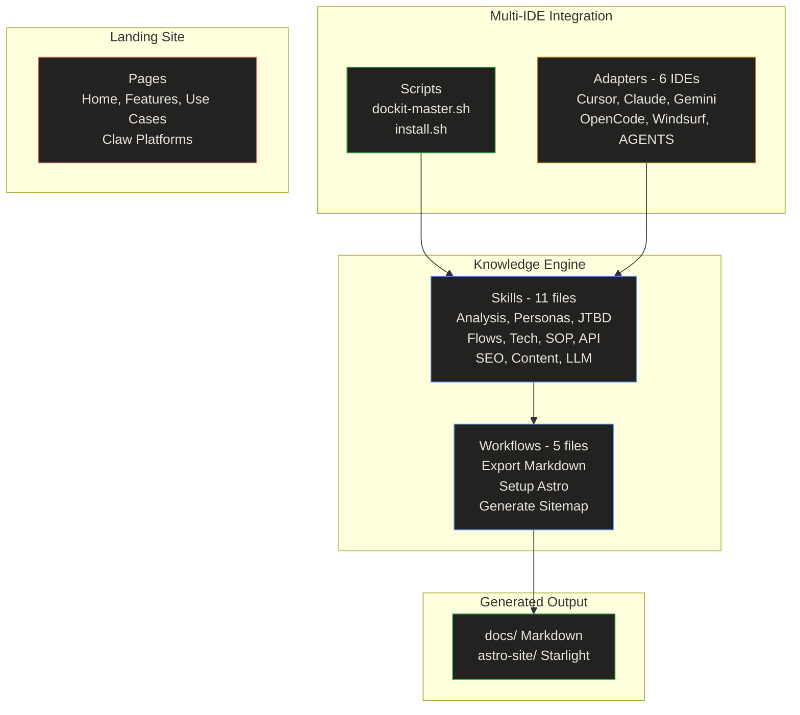
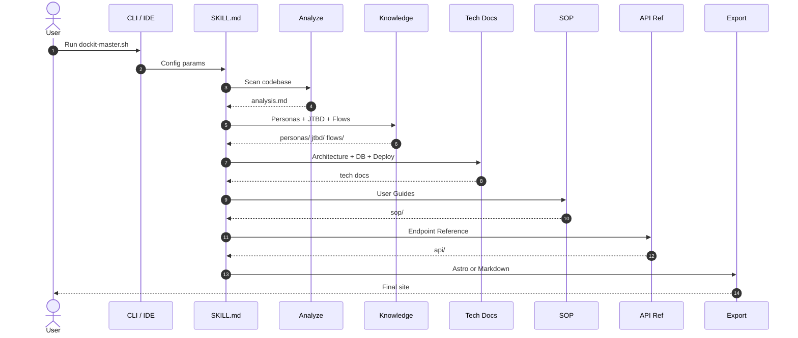

# Codebase Analysis

> **Quick Reference**
> - **Project**: DocKit Master
> - **Type**: AI Skill Engine / Static Landing Site
> - **Languages**: Markdown (skills), Bash (CLI), HTML/CSS/JS (landing pages)
> - **Frameworks**: Astro Starlight (docs output)
> - **Files**: ~96 (excluding node_modules, dist)
> - **Lines of Code**: ~12,000+

## Architecture



**Architecture summary:** DocKit Master is a skill-based AI documentation engine. The core consists of 11 Markdown skill files that instruct AI agents to analyze codebases and generate structured documentation. Workflows orchestrate the export process. Scripts provide CLI interaction, and adapters enable cross-IDE compatibility.

## Directory Structure

```
DocKit Master/
├── SKILL.md              # Main orchestrator (295 lines)
├── README.md             # Project overview
├── index.html            # Landing page (59K)
├── skills/               # 11 skill files — core engine
│   ├── analyze-codebase.md
│   ├── persona-builder.md
│   ├── jtbd-analyzer.md
│   ├── flow-mapper.md
│   ├── tech-docs.md
│   ├── sop-guide.md
│   ├── api-reference.md
│   ├── content-guidelines.md
│   ├── content-writing.md
│   ├── llm-optimization.md
│   └── seo-checklist.md
├── workflows/            # 5 workflow files
│   ├── export-markdown.md
│   ├── setup-astro.md
│   ├── generate-sitemap.md
│   ├── generate-docs.md
│   └── setup-docusaurus.md
├── scripts/              # 2 CLI scripts
│   ├── dockit-master.sh
│   └── install.sh
├── adapters/             # 6 IDE adapters
│   ├── cursor.mdc
│   ├── claude.md
│   ├── gemini.md
│   ├── opencode.md
│   ├── windsurf.md
│   └── agents.md
├── templates/            # 3 template sets
│   ├── astro-premium/
│   ├── docusaurus-premium/
│   └── markdown/
├── pages/                # Landing site sub-pages
│   ├── features/
│   ├── use-cases/
│   ├── claw/
│   ├── css/
│   └── js/
├── docs/                 # Generated documentation (this)
└── astro-site/           # Generated Astro Starlight site
```

## Core Components

| Component | Description | Key Files |
|-----------|-------------|-----------|
| **Skill Engine** | 11 instruction files guiding AI agents | `skills/*.md` |
| **Orchestrator** | Main entry point routing to skills | `SKILL.md` |
| **CLI** | Interactive Bash prompt generator | `scripts/dockit-master.sh` |
| **Installer** | Multi-IDE installer | `scripts/install.sh` |
| **IDE Adapters** | Entry points for 6 AI IDEs | `adapters/*` |
| **Astro Template** | Premium Starlight config | `templates/astro-premium/` |
| **Landing Site** | Multi-page showcase (vi/en/zh/ja) | `index.html`, `pages/` |

## Skill Pipeline



**Pipeline summary:** User triggers the CLI, SKILL.md orchestrates: Analyze → Knowledge → Tech → SOP → API → Export. Each step reads previous output and enriches it.

## Key Files

| File | Role | Size |
|------|------|------|
| `SKILL.md` | Main orchestrator | 13.2 KB |
| `skills/flow-mapper.md` | 4 flow type generator | 11.5 KB |
| `skills/persona-builder.md` | Buyer & User Personas | 8.6 KB |
| `skills/content-guidelines.md` | Content structure rules | 8.5 KB |
| `scripts/install.sh` | Multi-IDE installer | 8.5 KB |
| `scripts/dockit-master.sh` | Interactive CLI | 7.7 KB |
| `index.html` | Landing page | 59.4 KB |

## Architecture Decisions

| # | Decision | Rationale | Status |
|---|----------|-----------|--------|
| 1 | Markdown-based skills | Portable, IDE-agnostic, version-controllable | Accepted |
| 2 | Astro Starlight over Docusaurus | 50MB vs 1.5GB, auto-sidebar, native Markdown | Accepted |
| 3 | Knowledge layer first | Personas + JTBD + Flows enrich all downstream docs | Accepted |
| 4 | Multi-IDE adapters | Lightweight references to SKILL.md, no duplication | Accepted |
| 5 | SEO + LLM dual optimization | Every page serves both search engines and AI | Accepted |
