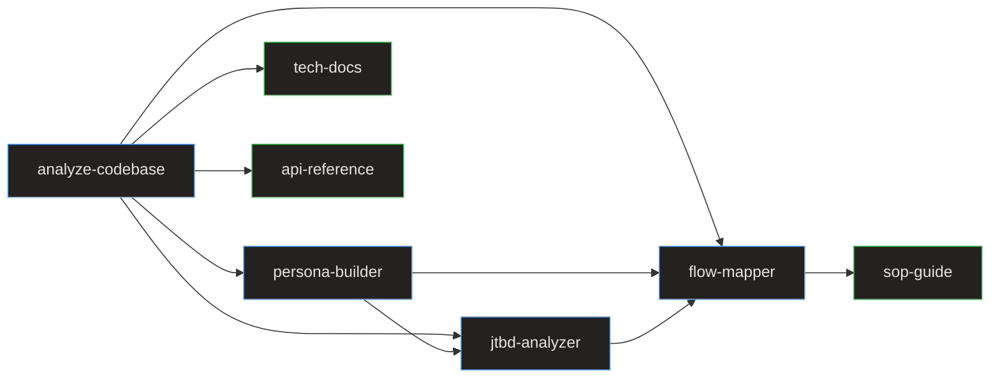

# Skill API Reference

> **Quick Reference**
> - **Total Skills**: 11 (4 knowledge + 3 docs + 4 quality)
> - **Total Workflows**: 5
> - **Input Format**: Markdown + YAML frontmatter
> - **Output Format**: Markdown files in docs/

DocKit Master skills function as an API — each skill file defines inputs, processing rules, and outputs. This reference documents the interface of each skill.

## Skills Overview

| Skill | Input | Output | Category |
|-------|-------|--------|----------|
| [analyze-codebase](./analyze-codebase) | Project files | analysis.md | Foundation |
| persona-builder | analysis.md, source code | personas/ | Knowledge |
| jtbd-analyzer | analysis.md, personas/ | jtbd/ | Knowledge |
| flow-mapper | analysis.md, personas/, jtbd/ | flows/ | Knowledge |
| tech-docs | analysis.md | architecture.md, database.md, etc. | Documentation |
| sop-guide | analysis.md, knowledge layer | sop/ | Documentation |
| api-reference | analysis.md | api/ | Documentation |
| [content-guidelines](./content-guidelines) | N/A (rules only) | N/A | Quality |
| content-writing | N/A (rules only) | N/A | Quality |
| llm-optimization | N/A (rules only) | N/A | Quality |
| seo-checklist | Generated docs | Audit report | Quality |

## Dependency Graph



**Dependency summary:** analyze-codebase is the root dependency. Knowledge skills chain: personas → JTBD → flows. Tech docs depend only on analysis. SOPs depend on the full knowledge layer.

## Common Configuration

All skills accept the global config object defined in Step 1:

```
DOC_TYPE     = knowledge | tech | sop | api | all
FORMAT       = markdown | astro
SCOPE        = full | focused
LANGUAGE     = en | vi | zh | ja
SEO          = yes | no
LLM_OPTIMIZE = yes | no
```

## Related

- [System Architecture](../architecture)
- [Data Flow](../data-flow)
- [Skill pipeline workflow](../flows/wf-skill-pipeline)
