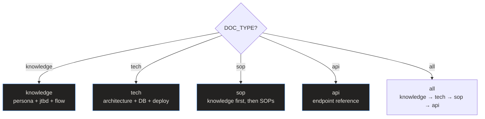

# SKILL.md Orchestrator API

> **Quick Reference**
> - **File**: `SKILL.md` (295 lines)
> - **Type**: Main entry point and router
> - **Input**: 10-parameter config object
> - **Output**: Routes to appropriate skills

## Interface

The orchestrator accepts a config object with 10 parameters:

| # | Parameter | Type | Required | Default |
|---|-----------|------|----------|---------|
| 1 | DOC_TYPE | enum | Yes | `all` |
| 2 | FORMAT | enum | Yes | `astro` |
| 3 | SCOPE | enum | Yes | `full` |
| 4 | FOCUS_TARGET | string | No | null |
| 5 | LANGUAGE | string | Yes | auto-detect |
| 6 | I18N | boolean | No | false |
| 7 | RECORD | boolean | No | false |
| 8 | PROJECT_PATH | path | Yes | workspace |
| 9 | SEO | boolean | No | true |
| 10 | LLM_OPTIMIZE | boolean | No | true |

## Routing Logic

**Routing summary:** The orchestrator maps DOC_TYPE to the corresponding skill files. For `all`, it runs all types sequentially: knowledge → tech → sop → api. For `sop`, it auto-runs knowledge first if not already generated.

## Execution Steps

| Step | Action | Condition |
|------|--------|-----------|
| 1 | Gather input | Always |
| 1b | Generate execution plan | Always |
| 2 | Analyze codebase | Always |
| 3 | Apply content guidelines | Always |
| 3b | Apply SEO + LLM guidelines | If SEO=yes or LLM=yes |
| 4 | Generate documents | Based on DOC_TYPE |
| 5 | Export | Based on FORMAT |
| 5b | Generate sitemap | If SEO=yes |
| 5c | Run SEO audit | If SEO=yes |
| 6 | Summary | Always |

## Related

- [analyze-codebase API](./analyze-codebase)
- [Skill pipeline workflow](../flows/wf-skill-pipeline)
- [System Architecture](../architecture)
