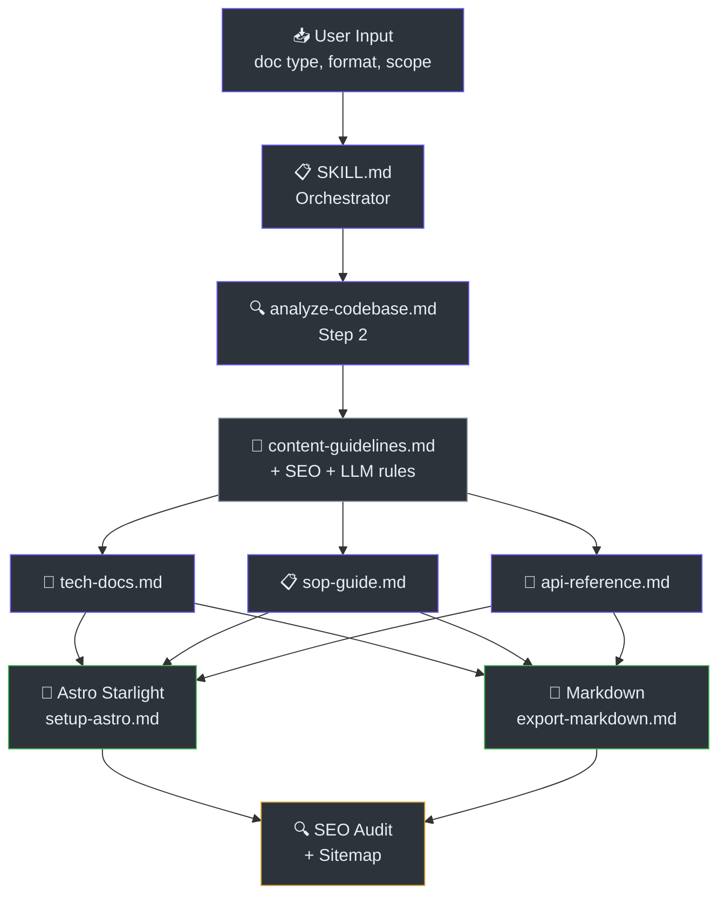
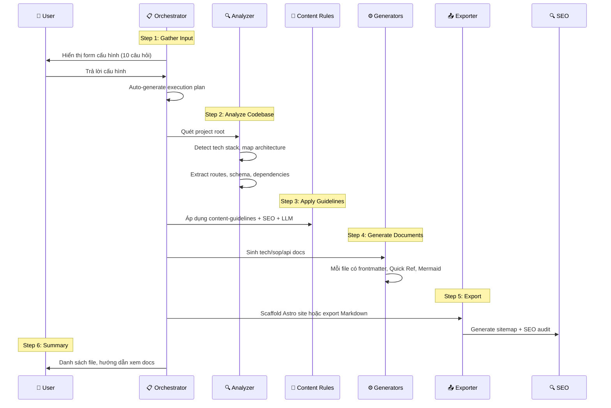

# Kiến Trúc Hệ Thống

> **Tham Khảo Nhanh**
> - **Loại**: Skill-based Pipeline (không phải microservices)
> - **Stack**: Markdown, Bash, CSS, Astro Starlight
> - **Modules chính**: Orchestrator, Analyzer, Generators (3), Exporters (2)
> - **Deployment**: Copy vào `~/.gemini/antigravity/skills/`

## Tổng Quan

DocKit Master là một **AI skill toolkit** chạy bên trong Google Antigravity. Nó không phải web app hay API server — mà là tập hợp các file Markdown hướng dẫn AI agent cách đọc code, phân tích kiến trúc, và sinh tài liệu chuyên nghiệp.

Kiến trúc dựa trên mô hình **orchestrator-worker**: `SKILL.md` điều phối toàn bộ quy trình, gọi từng skill con theo thứ tự.

## Sơ Đồ Kiến Trúc

Sơ đồ dưới mô tả luồng dữ liệu chính của DocKit Master, từ input người dùng đến output cuối cùng.

## Thành Phần Cốt Lõi

| Thành phần | File | Vai trò |
|------------|------|---------|
| **Orchestrator** | `SKILL.md` | Điều phối quy trình 6 bước, quản lý config |
| **Analyzer** | `skills/analyze-codebase.md` | Quét codebase, phát hiện tech stack, trích xuất schema |
| **Content Engine** | `skills/content-guidelines.md` | Quy tắc chất lượng: UX laws, Mermaid, frontmatter |
| **SEO Engine** | `skills/content-writing.md` + `seo-checklist.md` | SEO copywriting + per-page audit |
| **LLM Engine** | `skills/llm-optimization.md` | AI-readable structure, NotebookLM support |
| **Tech Generator** | `skills/tech-docs.md` | Sinh architecture, database, deployment, data-flow |
| **SOP Generator** | `skills/sop-guide.md` | Sinh hướng dẫn sử dụng từng bước |
| **API Generator** | `skills/api-reference.md` | Sinh tài liệu API/skill reference |
| **Astro Exporter** | `workflows/setup-astro.md` | Scaffold Astro Starlight site ★ |
| **Markdown Exporter** | `workflows/export-markdown.md` | Xuất Markdown thuần |
| **Sitemap Generator** | `workflows/generate-sitemap.md` | XML sitemap + robots.txt + NotebookLM URLs |
| **CLI** | `scripts/doc-gen.sh` | Giao diện dòng lệnh tương tác |

## Luồng Xử Lý Chi Tiết

Quy trình 6 bước được mô tả chi tiết dưới đây:

## Quyết Định Kiến Trúc (ADR)

| # | Quyết định | Bối cảnh | Trạng thái |
|---|-----------|----------|------------|
| 1 | Chuyển từ Docusaurus sang Astro Starlight | Docusaurus nặng (1.5GB node_modules), cần MDX escaping, sidebar thủ công | ✅ Accepted |
| 2 | Thêm SEO + LLM optimization | Documentation cần tối ưu cho cả search engines và AI agents | ✅ Accepted |
| 3 | Sitemap + NotebookLM support | Cho phép import docs vào NotebookLM để nghiên cứu | ✅ Accepted |
| 4 | Skill-based architecture (không phải code) | DocKit Master là AI prompt toolkit, không phải software | ✅ Accepted |

ADR-001: Chuyển từ Docusaurus sang Astro Starlight

**Bối cảnh:** Docusaurus 3 yêu cầu MDX escaping (`<`, `{`, `}`), sidebar thủ công (`sidebars.ts`), và node_modules nặng ~1.5GB. Build time ~30s.

**Quyết định:** Chuyển sang Astro Starlight với pure Markdown, auto-sidebar, built-in search (Pagefind), và node_modules chỉ ~50MB. Build time ~5s.

**Hệ quả:**
- ✅ Không cần escaping — Markdown thuần
- ✅ Auto-sidebar từ folder structure
- ✅ Built-in search, dark mode, i18n
- ✅ Build size giảm 30x
- ⚠️ Cần migration template mới

ADR-002: Tích hợp SEO + LLM Optimization

**Bối cảnh:** Documentation cần phục vụ cả người đọc, search engines, và AI agents.

**Quyết định:** Thêm 3 skill files mới: `content-writing.md` (SEO copywriting), `seo-checklist.md` (per-page audit), `llm-optimization.md` (AI-readable rules).

**Hệ quả:**
- ✅ Mỗi trang có SEO frontmatter (title, description, keywords, robots)
- ✅ Sitemap XML + `sitemap-urls.txt` cho NotebookLM
- ✅ Self-contained sections cho LLM chunking
- ⚠️ Tăng thời gian generation do thêm bước audit

## Bảo Mật

DocKit Master không có vấn đề bảo mật đặc biệt vì:
- Là tập hợp file Markdown prompt — không chạy server
- Không lưu trữ dữ liệu người dùng
- CLI script (`doc-gen.sh`) chỉ tạo prompt text và copy vào clipboard
- Output là static HTML site — không có backend

## Khả Năng Mở Rộng

| Khía cạnh | Chiến lược |
|-----------|-----------|
| Thêm doc type mới | Tạo file `skills/[new-type].md` và thêm vào bảng trong `SKILL.md` |
| Thêm output format | Tạo file `workflows/setup-[format].md` và template tương ứng |
| Thêm ngôn ngữ | Thêm locale vào `astro.config.mjs` và tạo thư mục dịch |
| Thêm SEO rules | Cập nhật `skills/seo-checklist.md` và `skills/content-writing.md` |

---

> Xem thêm: [Luồng dữ liệu](./data-flow) · [Hướng dẫn triển khai](./deployment)
