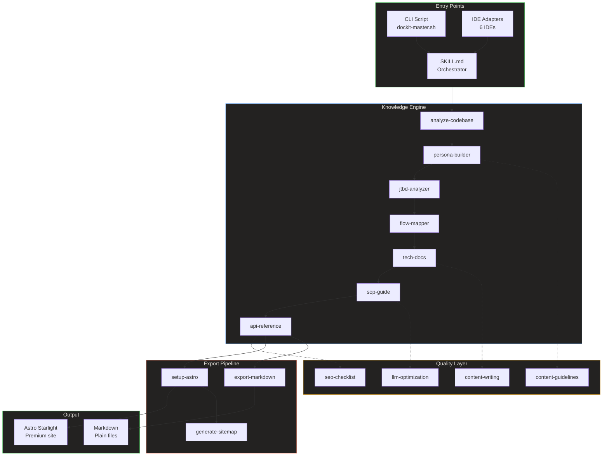

# System Architecture

> **Quick Reference**
> - **Type**: Skill-based AI documentation engine
> - **Stack**: Markdown (skills), Bash (CLI), Astro Starlight (output)
> - **Key Modules**: 11 skills, 5 workflows, 6 adapters, 2 scripts
> - **Deployment**: Static site (Astro) / Plain files (Markdown)

## Overview

DocKit Master is a knowledge systematization engine that transforms codebases into comprehensive documentation. Unlike traditional doc generators, it produces a complete knowledge base — personas, jobs-to-be-done, process flows, technical docs, SOPs, and API references — all from a single codebase scan.

## Architecture Diagram

**Architecture summary:** Entry points (CLI, IDE adapters) feed into the SKILL.md orchestrator, which sequentially runs the knowledge engine skills. The quality layer provides guidelines applied during generation. The export pipeline produces either a premium Astro Starlight site or plain Markdown files.

## Core Components

| Component | Files | Purpose |
|-----------|-------|---------|
| **Orchestrator** | `SKILL.md` (295 lines) | Routes to skills based on doc type, manages pipeline |
| **Knowledge Skills** | 3 skills (28.5 KB) | Personas, JTBD, Process Flows |
| **Documentation Skills** | 3 skills (21.7 KB) | Tech docs, SOP guides, API reference |
| **Quality Skills** | 4 skills (28 KB) | Content guidelines, SEO, LLM optimization |
| **Workflows** | 5 files (21.5 KB) | Export, sitemap, Astro setup |
| **CLI** | 2 scripts (16.1 KB) | Interactive prompt generator, multi-IDE installer |
| **Adapters** | 6 files (14.4 KB) | Cursor, Claude, Gemini, OpenCode, Windsurf, AGENTS |

## Architecture Decision Records

ADR-001: Markdown-based skills over code

**Context:** Skills need to work across 7+ AI IDEs with different runtimes.

**Decision:** Use pure Markdown instruction files instead of executable code.

**Consequences:**
- Portable across any AI agent that reads Markdown
- Version-controllable with Git
- No runtime dependencies
- Cannot enforce rules programmatically (relies on AI compliance)

ADR-002: Astro Starlight over Docusaurus

**Context:** Need a fast, modern documentation framework with search and dark mode.

**Decision:** Migrate from Docusaurus to Astro Starlight.

**Consequences:**
- 50MB vs 1.5GB node_modules
- Auto-generated sidebar (no manual sidebars.ts)
- Native Markdown (no MDX escaping issues)
- Built-in Pagefind search
- 5s vs 30s build time

ADR-003: Knowledge layer before documentation

**Context:** SOPs and API docs lack context without user understanding.

**Decision:** Generate Personas, JTBD, and Flows before tech/SOP/API docs.

**Consequences:**
- SOPs include "who this guide is for" context
- Flows provide visual process understanding
- JTBD aligns docs with user goals
- Increases total generation time by ~30%

## Related

- [Database and Data Model](./database)
- [Deployment Guide](./deployment)
- [Data Flow](./data-flow)
- [Personas](./personas/)
