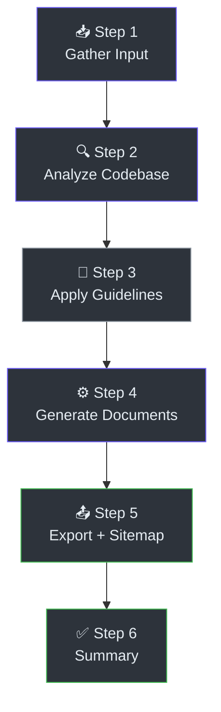
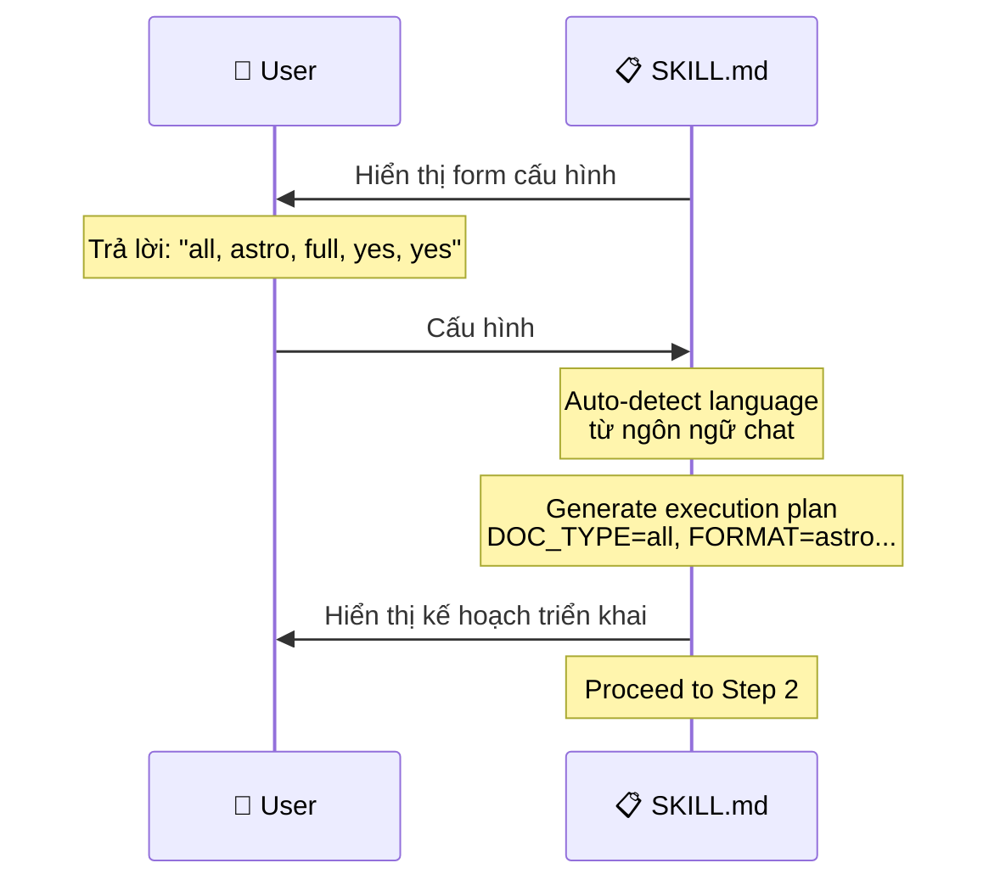
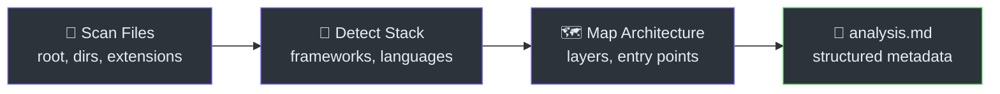
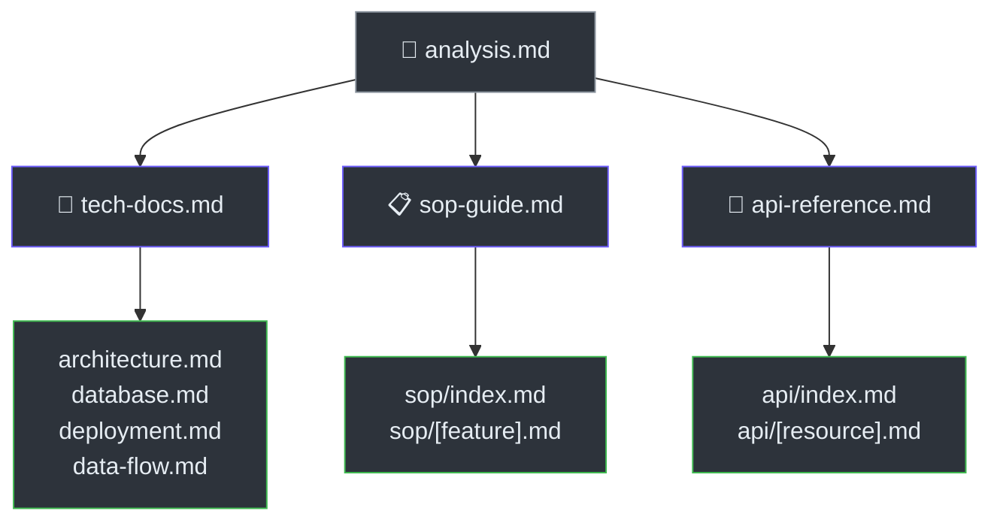
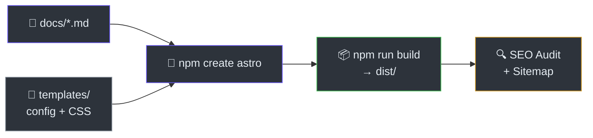

# Luồng Dữ Liệu

> **Tham Khảo Nhanh**
> - **Pattern**: Sequential Pipeline (6 bước)
> - **Input**: Câu trả lời cấu hình + source code
> - **Output**: Astro Starlight site hoặc Markdown files
> - **Serialization**: Markdown + YAML frontmatter

## Pipeline Tổng Quan

DocKit Master xử lý dữ liệu theo pipeline 6 bước tuần tự. Mỗi bước nhận output của bước trước làm input.

## Step 1: Gather Input

Orchestrator (`SKILL.md:41-118`) hiển thị form 10 câu hỏi cho người dùng. Output là execution config.

**Input:** Câu trả lời người dùng (text)
**Output:** Execution config object (10 fields)

## Step 2: Analyze Codebase

Analyzer (`skills/analyze-codebase.md`) quét toàn bộ codebase và tạo metadata.

**Quy trình quét:**
1. Đọc `README.md`, `package.json`, config files
2. Đếm files theo extension → detect languages
3. Detect frameworks từ signal files
4. Map 6 architecture layers (presentation, business, data, infra, integrations, testing)
5. Extract routes, database schema, dependencies

**Input:** Source code files
**Output:** `docs/analysis.md` với Quick Reference, Architecture diagram, tables

## Step 3: Apply Content Guidelines

Content engine áp dụng 3 bộ quy tắc song song:

| Bộ quy tắc | File | Mục đích |
|------------|------|---------|
| Content Guidelines | `skills/content-guidelines.md` | UX laws, Markdown rules, frontmatter schema |
| SEO Writing | `skills/content-writing.md` | Keyword placement, inverted pyramid, active voice |
| LLM Optimization | `skills/llm-optimization.md` | AI-readable heading, self-contained sections |

Các quy tắc này **không tạo output file** — chúng là constraints cho Step 4.

## Step 4: Generate Documents

3 generators chạy tuần tự, mỗi generator đọc `analysis.md` + source code:

### Tech Docs Generator

Sinh 4 file kỹ thuật với ≥2 Mermaid diagrams mỗi file:
- `architecture.md` — Sơ đồ kiến trúc, ADR
- `database.md` — Schema, ER diagram, indexes
- `deployment.md` — Cài đặt, cấu hình, CI/CD
- `data-flow.md` — Pipeline, sequence diagrams

### SOP Generator

Quét UI routes/components → nhóm theo module → sinh 1 file SOP per feature:
- Quick Reference card
- Step-by-step numbered guide
- Form field tables
- Troubleshooting (progressive disclosure)
- FAQ (schema-ready)

### API Generator

Quét route files → nhóm theo resource → sinh 1 file per resource:
- Endpoints overview table
- Parameters + response schemas
- Multi-language examples (cURL, Python, JS, Go)
- Error codes + rate limiting

## Step 5: Export

Tuỳ theo `FORMAT`, exporter scaffold output:

### Astro Path

1. `npm create astro@latest` — scaffold Starlight project
2. Copy premium template (config + CSS)
3. Copy docs into `src/content/docs/`
4. `npm install && npm run build`
5. Generate `sitemap-urls.txt` + `robots.txt`
6. Run SEO checklist trên mọi trang

### Markdown Path

Copy docs trực tiếp, tạo `docs/README.md` làm index.

## Step 6: Summary

Orchestrator hiển thị cho người dùng:
- Danh sách file đã tạo + kích thước
- Hướng dẫn xem/serve docs
- Next steps (customize, deploy)

## Tích Hợp Bên Ngoài

| Dịch vụ | Protocol | Hướng | Dữ liệu |
|---------|----------|-------|---------|
| Google Antigravity | Prompt/Response | Bidirectional | Markdown text |
| Clipboard (macOS) | `pbcopy` | Output only | Prompt text |
| npm Registry | HTTP | Download | Astro packages |
| NotebookLM | URL paste | Output only | `sitemap-urls.txt` |

---

> Xem thêm: [Kiến trúc hệ thống](./architecture) · [Phân tích mã nguồn](./analysis)
