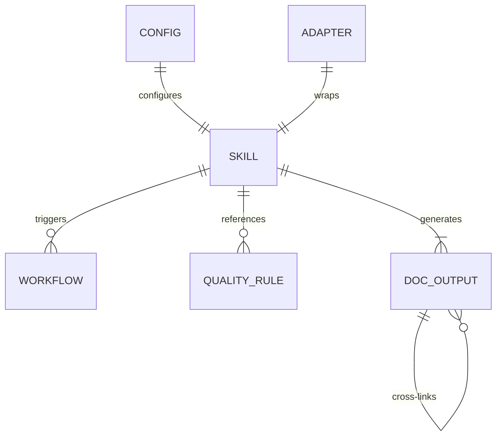

# Data Model

> **Quick Reference**
> - **Engine**: File system (no database)
> - **Data Format**: Markdown with YAML frontmatter
> - **Config**: Bash variables / YAML
> - **Output**: Structured directory tree

DocKit Master uses the file system as its data store. There is no traditional database — all data flows through Markdown files with YAML frontmatter.

## Entity Relationship

**ER summary:** A Config object drives the SKILL orchestrator, which triggers Workflows and references Quality Rules. Each SKILL generates Doc Outputs that cross-link to each other. Adapters wrap the SKILL for different IDEs.

## Entities

### Config Object

The execution configuration gathered in Step 1:

| Field | Type | Required | Default | Description |
|-------|------|----------|---------|-------------|
| DOC_TYPE | enum | Yes | `all` | knowledge, tech, sop, api, all |
| FORMAT | enum | Yes | `astro` | astro, markdown |
| SCOPE | enum | Yes | `full` | full, focused |
| FOCUS_TARGET | string | No | null | Directory name if focused |
| LANGUAGE | string | Yes | auto-detect | vi, en, zh, ja |
| I18N | boolean | No | false | Multi-language support |
| RECORD | boolean | No | false | Browser walkthrough recording |
| PROJECT_PATH | path | Yes | workspace | Absolute path to project |
| SEO | boolean | No | true | SEO optimization |
| LLM_OPTIMIZE | boolean | No | true | AI-readable optimization |

### Skill File Schema

Every skill file follows this structure:

| Section | Required | Purpose |
|---------|----------|---------|
| Title (H1) | Yes | Skill name and description |
| Input Required | Yes | What files/data this skill needs |
| Content Guidelines | Yes | Links to quality skills |
| Procedure | Yes | Step-by-step instructions |
| Output Template | Yes | Markdown template for generated files |
| Rules | Yes | Constraints and requirements |

### Doc Output Schema (YAML Frontmatter)

Every generated Markdown file must include:

| Field | Type | Required | Example |
|-------|------|----------|---------|
| title | string | Yes | "System Architecture" |
| description | string | Yes | "Architecture overview..." (150-160 chars) |
| keywords | string[] | Recommended | ["architecture", "system design"] |
| robots | string | Recommended | "index, follow" |
| sidebar.order | number | Recommended | 2 |

## Related

- [System Architecture](./architecture)
- [Data Flow](./data-flow)
- [Content guidelines API](./api/content-guidelines)
