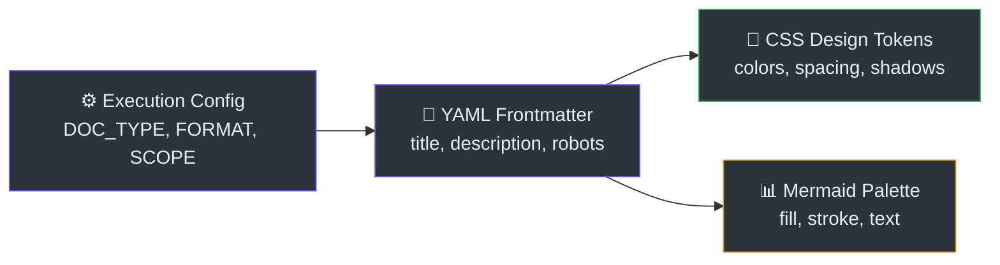

# Cấu Trúc Dữ Liệu

> **Tham Khảo Nhanh**
> - **Kiểu dữ liệu**: Config schemas, Design tokens, YAML frontmatter
> - **Storage**: File-based (Markdown + CSS + JS config)
> - **Database**: Không có (stateless skill toolkit)
> - **ORM**: Không áp dụng

## Tổng Quan

DocKit Master không sử dụng database truyền thống. Thay vào đó, dữ liệu được quản lý qua ba loại chính: **Execution Config** (runtime), **YAML Frontmatter** (per-page metadata), và **CSS Design Tokens** (visual system).



## Execution Config Schema

Khi người dùng trả lời form cấu hình (Step 1), SKILL.md tạo execution config (`SKILL.md:89-100`):

| Field | Type | Values | Default | Mô tả |
|-------|------|--------|---------|-------|
| `DOC_TYPE` | enum | `tech`, `sop`, `api`, `all` | `all` | Loại tài liệu cần tạo |
| `FORMAT` | enum | `markdown`, `astro` | `astro` | Định dạng output |
| `SCOPE` | enum | `full`, `focused` | `full` | Phạm vi quét code |
| `FOCUS_TARGET` | string | directory/module name | `null` | Thư mục cụ thể (nếu focused) |
| `LANGUAGE` | string | `vi`, `en`, `vi+en`, ... | auto-detect | Ngôn ngữ viết docs |
| `I18N` | boolean | `yes`, `no` | `no` | Đa ngôn ngữ (chỉ cho astro) |
| `RECORD` | boolean | `yes`, `no` | `no` | Quay video walkthrough |
| `PROJECT_PATH` | string | absolute path | workspace | Đường dẫn project |
| `SEO` | boolean | `yes`, `no` | `yes` | SEO optimization |
| `LLM_OPTIMIZE` | boolean | `yes`, `no` | `yes` | AI/LLM optimization |

## YAML Frontmatter Schema

Mỗi file `.md` được tạo phải có frontmatter theo chuẩn (`content-guidelines.md:66-98`):

### Frontmatter Tối Thiểu (Bắt buộc)

```yaml
---
title: "Tiêu Đề Trang"             # 50-60 chars, có keyword
description: "Mô tả ngắn"          # 150-160 chars, có CTA
---
```

### Frontmatter SEO Đầy Đủ (Khuyến nghị)

```yaml
---
title: "Page Title — Primary Keyword"
description: "Compelling description with CTA"
keywords: ["primary keyword", "related term"]
robots: "index, follow"
canonical: ""
og_title: ""
og_description: ""
og_type: "article"
sidebar:
  order: 1
  badge:
    text: New
    variant: tip
last_updated: "2026-02-27"
---
```

### Robots Directive

| Giá trị | Ý nghĩa | Dùng cho |
|---------|---------|---------|
| `"index, follow"` | Crawl + follow links ✅ | **Mặc định** — tất cả public docs |
| `"noindex, nofollow"` | Không index, không follow | Drafts, admin pages |
| `"noindex, follow"` | Không index nhưng follow links | Duplicate content |

## CSS Design Tokens

Design system được định nghĩa trong `templates/astro-premium/src/styles/custom.css:18-49`:

### Color Palette

| Token | Light | Dark | Mục đích |
|-------|-------|------|---------|
| `--sl-color-accent` | `#6d5dfc` | `#8a7efd` | Màu nhấn chính |
| `--sl-color-accent-low` | `#eee8ff` | `#1a1440` | Background nhấn |
| `--sl-color-accent-high` | `#3520a0` | `#d0c9ff` | Text nhấn |
| `--sl-color-bg` | — | `#0d1117` | Background chính (dark) |
| `--sl-color-bg-nav` | — | `rgba(22,27,34,0.85)` | Navbar glassmorphism |
| `--sl-color-text` | — | `#e6edf3` | Text chính |

### Spacing System (8px Grid)

| Token | Giá trị | Sử dụng |
|-------|---------|---------|
| `--doc-spacing-xs` | `0.25rem` (4px) | Padding nội dung nhỏ |
| `--doc-spacing-sm` | `0.5rem` (8px) | Padding bảng |
| `--doc-spacing-md` | `1rem` (16px) | Margin thẻ |
| `--doc-spacing-lg` | `1.5rem` (24px) | Padding admonition |
| `--doc-spacing-xl` | `2rem` (32px) | Heading margin |
| `--doc-spacing-2xl` | `3rem` (48px) | Section spacing |

### Mermaid Dark-Mode Palette

Tất cả Mermaid diagrams phải dùng bảng màu này (`content-guidelines.md:206-218`):

| Thành phần | Màu | Mã hex |
|------------|-----|--------|
| Node fill | Dark gray | `#2d333b` |
| Node border | Purple | `#6d5dfc` |
| Node text | Light | `#e6edf3` |
| Background | Dark | `#161b22` |
| Edge lines | Gray | `#8b949e` |
| Highlight | Bright purple | `#8a7efd` |
| Success | Green | `#3fb950` |
| Warning | Yellow | `#d29922` |
| Danger | Red | `#f85149` |

## Astro Config Schema

File `templates/astro-premium/astro.config.mjs` chứa cấu hình Starlight:

| Thuộc tính | Kiểu | Mô tả |
|-----------|------|-------|
| `title` | string | Tên project hiển thị |
| `description` | string | Mô tả project |
| `defaultLocale` | string | Locale mặc định (`root`) |
| `locales` | object | Map locale → label + lang |
| `customCss` | string[] | Custom CSS paths |
| `tableOfContents` | object | `minHeadingLevel: 2, maxHeadingLevel: 3` |
| `lastUpdated` | boolean | Hiển thị ngày cập nhật |
| `site` | string | URL triển khai (cho sitemap) |

---

> Xem thêm: [Kiến trúc hệ thống](./architecture) · [Luồng dữ liệu](./data-flow)
