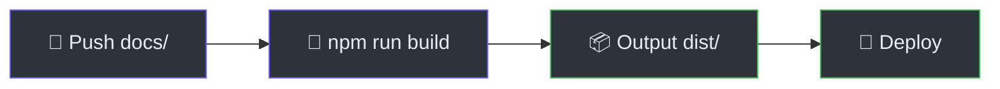

# Hướng Dẫn Triển Khai

> **Tham Khảo Nhanh**
> - **Platform**: macOS (CLI), mọi OS (chat mode)
> - **Yêu cầu**: Node.js 18+, Google Antigravity
> - **Cài đặt**: Copy folder vào `~/.gemini/antigravity/skills/`
> - **Output**: Static Astro site hoặc Markdown files

## Yêu Cầu Hệ Thống

| Thành phần | Tối thiểu | Khuyến nghị |
|-----------|---------|-------------|
| Node.js | 18.x | 20.x LTS |
| npm | 9.x | 10.x |
| Disk | 100MB (skill files) | 500MB (khi build Astro site) |
| OS (CLI) | macOS (pbcopy) | macOS |
| OS (Chat) | Bất kỳ | Bất kỳ |

## Cài Đặt

### Bước 1: Copy Skill vào Antigravity

```bash
# Copy toàn bộ doc-kit vào skills directory
cp -r doc-kit ~/.gemini/antigravity/skills/

# Cấp quyền thực thi cho CLI
chmod +x ~/.gemini/antigravity/skills/doc-kit/scripts/doc-gen.sh
```

### Bước 2: Kiểm Tra Cài Đặt

```bash
# Verify skill tồn tại
ls ~/.gemini/antigravity/skills/doc-kit/SKILL.md

# Verify CLI hoạt động
bash ~/.gemini/antigravity/skills/doc-kit/scripts/doc-gen.sh
```

:::tip[Cài đặt 1 lầp duy nhất]
Sau khi copy xong, DocKit Master sẵn sàng cho mọi project. Không cần cài thêm dependencies trừ khi bạn chọn output Astro.
:::

## Sử Dụng

### Cách 1: Chat Mode (Khuyến nghị)

Gõ trực tiếp trong Google Antigravity session:

```
Dùng DocKit Master để tạo tài liệu cho project tại /đường/dẫn/project
```

Hoặc trigger ngắn:

```
/DocKit Master
```

Agent sẽ hỏi 10 câu hỏi cấu hình → tự động lên plan → bắt đầu quét code và sinh tài liệu.

### Cách 2: CLI Script

```bash
bash ~/.gemini/antigravity/skills/doc-kit/scripts/doc-gen.sh
```

CLI hỏi 4 câu hỏi:
1. **Document Type**: tech / sop / api / all
2. **Output Format**: astro (★) / markdown
3. **Source Code Path**: đường dẫn project
4. **Language**: English / Vietnamese

→ Tạo prompt tối ưu và tự copy vào clipboard. Paste vào Antigravity.

## Build Astro Site

Sau khi DocKit Master sinh docs vào `docs/`, build Astro site:

```bash
# Scaffold Astro Starlight (từ setup-astro.md workflow)
cd [project_root]
npm create astro@latest ./astro-site -- --template starlight --no-install --no-git --yes

# Copy premium template
cp ~/.gemini/antigravity/skills/doc-kit/templates/astro-premium/astro.config.mjs \
   astro-site/astro.config.mjs
mkdir -p astro-site/src/styles
cp ~/.gemini/antigravity/skills/doc-kit/templates/astro-premium/src/styles/custom.css \
   astro-site/src/styles/custom.css

# Copy generated docs
rm -rf astro-site/src/content/docs/*
cp -r docs/*.md astro-site/src/content/docs/
[ -d docs/sop ] && cp -r docs/sop astro-site/src/content/docs/
[ -d docs/api ] && cp -r docs/api astro-site/src/content/docs/

# Build
cd astro-site
npm install
npm run build
```

:::caution[Tuỳ chỉnh cấu hình]
Nhớ thay thế các `[PLACEHOLDER]` trong `astro.config.mjs`: `[Project Name]`, `[GITHUB_URL]`, `site` URL.
:::

## CI/CD Pipeline

Luồng CI/CD cho deploy documentation site:



### Deploy lên GitHub Pages

```bash
cd astro-site
npm run build
# Output trong dist/ — upload lên GitHub Pages
```

### Deploy lên Cloudflare Pages

Trong Cloudflare dashboard:
- **Build command**: `npm run build`
- **Output directory**: `dist/`
- **Node.js version**: `18`

### Deploy lên Vercel

```bash
cd astro-site
npx vercel --prod
```

## Cấu Trúc Output

### Astro Output

```
astro-site/
├── astro.config.mjs        # Cấu hình Starlight
├── src/
│   ├── content/docs/        # Markdown content
│   │   ├── index.md
│   │   ├── architecture.md
│   │   ├── database.md
│   │   ├── deployment.md
│   │   ├── data-flow.md
│   │   ├── sop/
│   │   └── api/
│   └── styles/
│       └── custom.css       # Premium CSS
├── public/
│   └── robots.txt
└── dist/                    # Build output (static HTML)
```

### Markdown Output

```
docs/
├── index.md                 # Trang chủ
├── architecture.md
├── database.md
├── deployment.md
├── data-flow.md
├── analysis.md
├── sop/
│   ├── index.md
│   └── [feature].md
└── api/
    ├── index.md
    └── [resource].md
```

## Xử Lý Lỗi Phổ Biến

| Lỗi | Nguyên nhân | Cách sửa |
|------|------------|----------|
| Missing `title` in frontmatter | Starlight yêu cầu `title` | Thêm `title: "..."` vào frontmatter |
| Duplicate slugs | Hai file cùng tên | Đổi tên một file |
| Build fails on Mermaid | Starlight không hỗ trợ Mermaid mặc định | `npm install remark-mermaidjs` và thêm vào config |
| `_analysis.md` not found | Underscore prefix bị auto-sidebar bỏ qua | Dùng `analysis.md` thay vì `_analysis.md` |

---

> Xem thêm: [Kiến trúc hệ thống](./architecture) · [Sử dụng CLI](./sop/using-cli)
