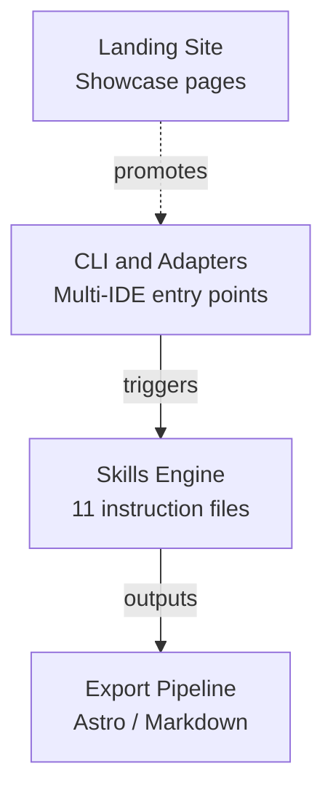

# Process Flows

> **Quick Reference**
> - **Workflows**: 2
> - **Sequences**: 1
> - **Lifecycles**: 1
> - **Journeys**: 1
> - **Total Diagrams**: 5

## System Overview

**System overview summary:** The CLI and adapters trigger the skills engine, which produces documentation output through the export pipeline. The landing site promotes the tool to new users.

## Flow Directory

### Workflows (Business Process)

| # | Flow | Module | Persona | Link |
|---|------|--------|---------|------|
| 1 | Skill Execution Pipeline | Core Engine | AI Agent Alex | [View](./wf-skill-pipeline) |
| 2 | Multi-IDE Installation | Scripts | Developer Dana | [View](./wf-installation) |

### Sequences (Component Interaction)

| # | Flow | Feature | Components | Link |
|---|------|---------|-----------|------|
| 1 | Doc Generation Sequence | Full pipeline | 6 participants | [View](./seq-doc-generation) |

### Lifecycles (Entity States)

| # | Entity | States | Transitions | Link |
|---|--------|--------|------------|------|
| 1 | Documentation Project | 5 states | 6 transitions | [View](./lc-doc-project) |

### Journeys (User Experience)

| # | Journey | Persona | Steps | Link |
|---|---------|---------|-------|------|
| 1 | Documentation Consumption | PM Parker | 8 steps | [View](./uj-doc-consumption) |

## Related

- [Personas](../personas/)
- [Jobs To Be Done](../jtbd/)
- [System Architecture](../architecture)
