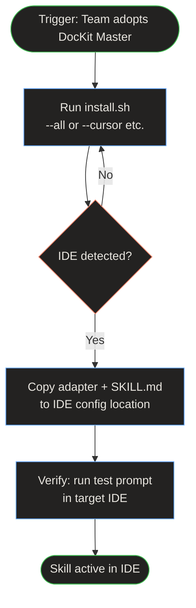

# Multi-IDE Installation — Workflow

> **Quick Reference**
> - **Persona**: [Developer Dana](../personas/user-developer)
> - **JTBD**: [Configure tooling for team](../jtbd/configure-tooling)
> - **Trigger**: Team adopts DocKit Master
> - **Outcome**: Skill installed and working in target IDE(s)

## Process Flow

**Workflow summary:** Developer runs install.sh with target IDE flag. The script detects the IDE config location, copies the adapter and SKILL.md, then verifies the installation by suggesting a test prompt.

## Step Details

| Step | Action | Source |
|------|--------|--------|
| 1 | Choose IDE(s) | `scripts/install.sh` — interactive or `--all` flag |
| 2 | Detect IDE config path | Auto-detect from known locations |
| 3 | Copy adapter file | Copy from `adapters/` to IDE config dir |
| 4 | Copy SKILL.md + skills/ | Optional `--copy-skills` for offline use |
| 5 | Verify installation | Suggest test prompt to paste in IDE |

## Related

- [Developer Dana](../personas/user-developer)
- [Using the CLI](../sop/using-cli)
- [Skill pipeline workflow](./wf-skill-pipeline)
