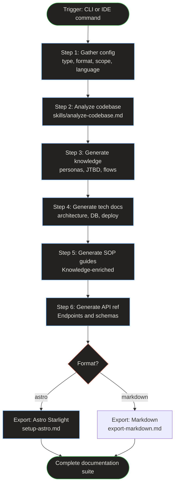

# Skill Execution Pipeline — Workflow

> **Quick Reference**
> - **Persona**: [AI Agent Alex](../personas/user-ai-agent)
> - **JTBD**: [Systematize codebase knowledge](../jtbd/systematize-knowledge)
> - **Trigger**: User runs CLI or invokes /DocKit Master command
> - **Outcome**: Complete documentation suite in docs/ or astro-site/

## Process Flow

**Workflow summary:** The pipeline starts with configuration gathering, then sequentially runs codebase analysis, knowledge generation, technical documentation, SOP guides, and API reference. Finally, it exports to either Astro Starlight or plain Markdown based on user choice.

## Step Details

| Step | Action | Skill File | Output |
|------|--------|-----------|--------|
| 1 | Gather input (10 config questions) | `SKILL.md:42-82` | Config object |
| 2 | Analyze codebase (scan, detect, map) | `skills/analyze-codebase.md` | `docs/analysis.md` |
| 3 | Generate knowledge layer | `persona-builder.md`, `jtbd-analyzer.md`, `flow-mapper.md` | `docs/personas/`, `docs/jtbd/`, `docs/flows/` |
| 4 | Generate technical docs | `skills/tech-docs.md` | `docs/architecture.md`, `docs/database.md`, etc. |
| 5 | Generate SOP guides | `skills/sop-guide.md` | `docs/sop/` |
| 6 | Generate API reference | `skills/api-reference.md` | `docs/api/` |
| 7 | Export to chosen format | `workflows/setup-astro.md` or `workflows/export-markdown.md` | `astro-site/` or `docs/` |

## Related

- [Doc generation sequence](./seq-doc-generation)
- [AI Agent Alex](../personas/user-ai-agent)
- [Generating tech docs SOP](../sop/generating-tech-docs)
