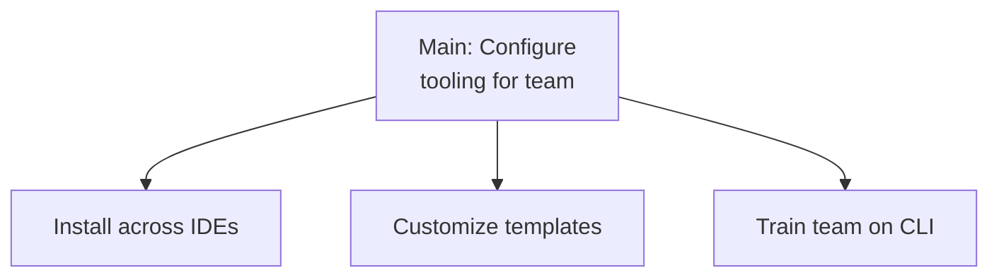

# Configure Documentation Tooling for Development Team

> **Quick Reference**
> - **Job Performer**: [Developer Dana](../personas/user-developer)
> - **Job Type**: Related
> - **Frequency**: Monthly
> - **Complexity**: Moderate

## Canvas

### Job Statement

> **When** a team adopts DocKit Master for documentation,
> **I want to** install and configure it across all team members' IDEs,
> **so that** everyone can generate consistent documentation without setup friction.

### Job Map

### Job Steps

| Step | Small Job | Micro-jobs | Source |
|------|-----------|-----------|--------|
| 1 | Install across IDEs | Run install.sh, verify adapters, test in each IDE | `scripts/install.sh` |
| 2 | Customize templates | Modify Astro config, adjust CSS, set site URL | `templates/astro-premium/` |
| 3 | Train team on CLI | Demo dockit-master.sh, share generated prompts | `scripts/dockit-master.sh` |

## Related

- **Persona**: [Developer Dana](../personas/user-developer)
- **SOP**: [Using the CLI](../sop/using-cli)
- **Flow**: [Installation workflow](../flows/wf-installation)
