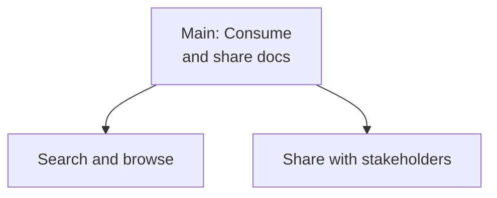

# Consume and Share Generated Documentation

> **Quick Reference**
> - **Job Performer**: [PM Parker](../personas/user-product-manager)
> - **Job Type**: Core
> - **Frequency**: Weekly
> - **Complexity**: Simple

## Canvas

### Job Statement

> **When** documentation has been generated for a project,
> **I want to** search, browse, and share it with stakeholders,
> **so that** team alignment improves and onboarding time decreases.

### Job Map

### Job Steps

| Step | Small Job | Micro-jobs | Source |
|------|-----------|-----------|--------|
| 1 | Search and browse | Open Astro site, use Pagefind search, navigate sidebar | `workflows/setup-astro.md:116-122` |
| 2 | Share with stakeholders | Copy link, extract Mermaid diagram, embed in slides | Output in `astro-site/dist/` |

## Related

- **Persona**: [PM Parker](../personas/user-product-manager)
- **Flow**: [Documentation consumption journey](../flows/uj-doc-consumption)
- **Architecture**: [System Architecture](../architecture)
