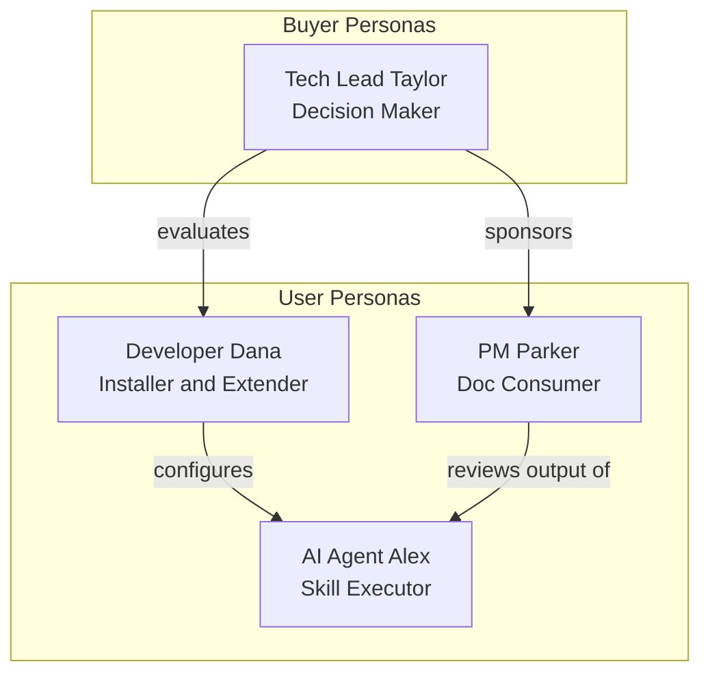

# Personas

> **Quick Reference**
> - **User Personas**: 3 (AI Agent, Developer, Product Manager)
> - **Buyer Personas**: 1 (Tech Lead / CTO)
> - **Last Updated**: 2026-02-28
> - **Source**: Automated extraction from codebase

## Persona Ecosystem

**Ecosystem summary:** Tech Lead Taylor evaluates and approves DocKit Master. Developer Dana installs and configures it. AI Agent Alex executes the skill pipeline. PM Parker consumes the output for product decisions.

## Directory

### Buyer Personas

| # | Persona | JTBD | Buyer Type |
|---|---------|------|-----------|
| 1 | [Tech Lead Taylor](./buyer-tech-lead) | Systematize team knowledge to reduce onboarding | Decision Maker |

### User Personas

| # | Persona | Role | Key Modules | Frequency |
|---|---------|------|------------|-----------|
| 1 | [AI Agent Alex](./user-ai-agent) | Skill Executor | All 11 skills, 5 workflows | Per-invocation |
| 2 | [Developer Dana](./user-developer) | Installer & Extender | scripts/, adapters/, SKILL.md | Weekly |
| 3 | [PM Parker](./user-product-manager) | Documentation Consumer | docs/, astro-site/ | Weekly |

## Persona × Feature Matrix

| Feature | AI Agent Alex | Developer Dana | PM Parker | Tech Lead Taylor |
|---------|:-:|:-:|:-:|:-:|
| Skill execution | ✅ Full | 👁️ Read | ❌ | 👁️ Read |
| CLI prompt generation | ❌ | ✅ Full | ✅ Full | ❌ |
| Multi-IDE installation | ❌ | ✅ Full | ❌ | 👁️ Review |
| Doc output review | ❌ | 👁️ Read | ✅ Full | ✅ Full |
| Skill customization | ❌ | ✅ Full | ❌ | 👁️ Review |
| Astro site build | ✅ Full | ✅ Full | ❌ | ❌ |

## Related

- [Jobs To Be Done](../jtbd/)
- [Process Flows](../flows/)
- [System Architecture](../architecture)
