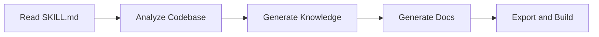

# AI Agent Alex — Skill Executor

> **Quick Reference**
> - **Role**: AI Coding Agent (Antigravity, Claude, Cursor, Gemini CLI, etc.)
> - **Tech Proficiency**: Advanced (LLM-powered)
> - **Frequency**: Per-invocation (on-demand)
> - **Key Modules**: All 11 skills, 5 workflows, SKILL.md orchestrator

## Profile

| Attribute | Detail |
|-----------|--------|
| **Persona Name** | AI Agent Alex |
| **Role in System** | Primary skill executor — reads SKILL.md and runs pipeline |
| **Reports To** | Developer Dana (configures) / PM Parker (reviews output) |
| **Instances** | 7 IDE variants (`adapters/`) |

## Goals and Motivations

- Execute the skill pipeline accurately from Step 1 to Step 6
- Generate SEO-optimized content following all quality guidelines
- Produce LLM-friendly output with clean structure and text fallbacks

## Pain Points

- Context window limits cause incomplete analysis on large codebases (`skills/analyze-codebase.md:6`)
- Non-standard frameworks make role extraction difficult (`skills/persona-builder.md:22`)
- Build failures when frontmatter is missing or filenames use underscores (`workflows/setup-astro.md:98`)

## Feature Usage Map

| Feature | Access | Frequency | JTBD |
|---------|--------|-----------|------|
| SKILL.md orchestrator | Execute | Every invocation | Route to correct skill |
| analyze-codebase.md | Execute | Every invocation | Scan project structure |
| persona-builder.md | Execute | When type=knowledge/all | Generate personas |
| jtbd-analyzer.md | Execute | When type=knowledge/all | Extract JTBD canvases |
| flow-mapper.md | Execute | When type=knowledge/all | Create flow diagrams |
| tech-docs.md | Execute | Every invocation | Generate architecture docs |
| sop-guide.md | Execute | When type=sop/all | Generate user guides |
| content-guidelines.md | Read | Every generation | Apply formatting rules |
| setup-astro.md | Execute | When format=astro | Build Starlight site |

## Typical Workflow

**Workflow summary:** AI Agent Alex reads SKILL.md, scans the target codebase, generates knowledge artifacts (personas, JTBD, flows), creates documentation (tech, SOP, API), and exports to the chosen format.

## Related

- [Systematize knowledge JTBD](../jtbd/systematize-knowledge)
- [Skill execution pipeline flow](../flows/wf-skill-pipeline)
- [Developer Dana](./user-developer) — the human who configures this agent
