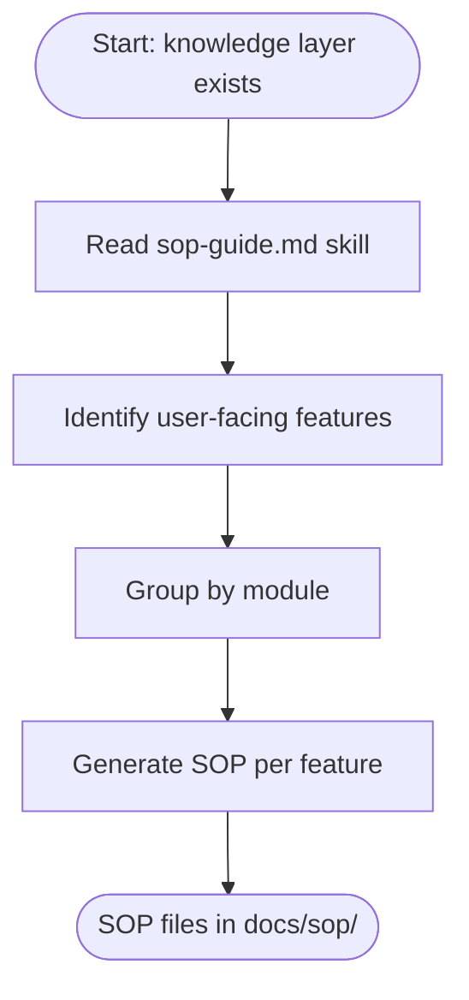

# Generating SOP Guides

> **Quick Reference**
> - **Who**: AI Agent (via IDE)
> - **Where**: AI Coding IDE
> - **Time**: ~10-15 minutes
> - **Prerequisites**: Knowledge layer (personas, JTBD, flows) recommended

## Persona Context

> **This guide is for**: [AI Agent Alex](../personas/user-ai-agent)
>
> **Job To Be Done**: [Systematize codebase knowledge](../jtbd/systematize-knowledge)

## What Makes SOPs Special

DocKit Master SOPs are not just step-by-step instructions. They include:

| Feature | Traditional SOP | DocKit Master SOP |
|---------|----------------|-------------------|
| Steps | Yes | Yes |
| Persona context | No | Who this guide is for |
| JTBD alignment | No | Why the user does this |
| Process flow | No | Mermaid workflow diagram |
| User journey | No | Satisfaction scoring |
| Troubleshooting | Sometimes | Always (progressive disclosure) |
| FAQ | Sometimes | Always (schema-ready for SEO) |

## Process Flow

## Step-by-Step Guide

### Step 1: Generate Knowledge Layer First

SOP guides are enriched with personas, JTBD, and flows. If these do not exist, the SOP skill automatically runs the knowledge skills first.

### Step 2: Invoke SOP Generation

Use DOC_TYPE = `sop` or `all` in the configuration prompt.

### Step 3: Review Each SOP

Each SOP file should contain these sections in order:
1. Quick Reference card
2. Persona Context (linked to persona + JTBD)
3. Process Flow (inline Mermaid diagram)
4. Prerequisites checklist
5. Numbered step-by-step guide
6. Expected Results
7. Troubleshooting (in `
` tags)
8. FAQ (H3 questions under H2 FAQ)

## Related

- [Using the CLI](./using-cli)
- [Generating Tech Docs](./generating-tech-docs)
- [Personas overview](../personas/)
- [JTBD overview](../jtbd/)
