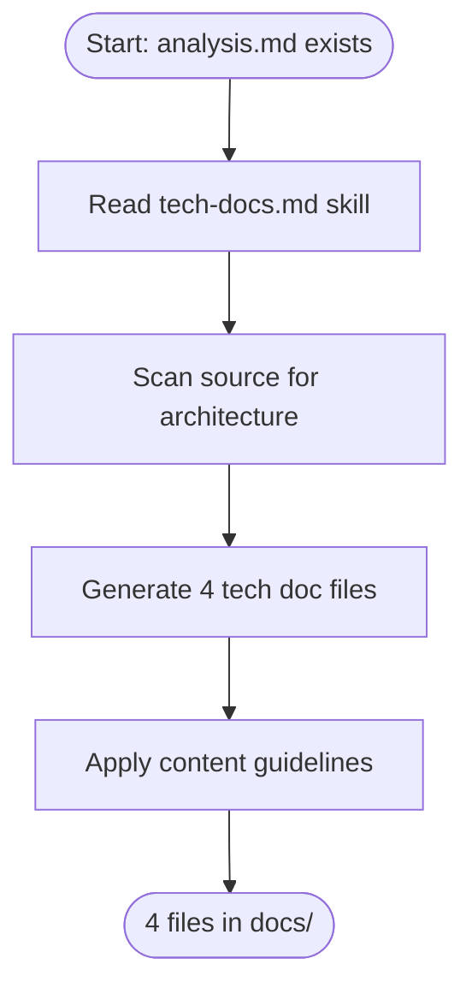

# Generating Technical Documentation

> **Quick Reference**
> - **Who**: AI Agent (via IDE)
> - **Where**: AI Coding IDE
> - **Time**: ~5-10 minutes
> - **Prerequisites**: Project path, SKILL.md access

## Persona Context

> **This guide is for**: [AI Agent Alex](../personas/user-ai-agent)
>
> **Job To Be Done**: [Systematize codebase knowledge](../jtbd/systematize-knowledge)
> — _"When a codebase lacks documentation, I want to generate it automatically, so that the team has a complete reference."_

## What Gets Generated

| File | Content | Skill |
|------|---------|-------|
| architecture.md | System overview, component diagram, ADRs | tech-docs.md |
| database.md | Data model, ER diagram, schema tables | tech-docs.md |
| deployment.md | Installation, config, hosting options | tech-docs.md |
| data-flow.md | Pipeline diagrams, transformation tables | tech-docs.md |

## Process Flow

## Step-by-Step Guide

### Step 1: Ensure Analysis Exists

The tech docs skill requires `docs/analysis.md` as input. Run `analyze-codebase.md` first if it does not exist.

### Step 2: Invoke Tech Docs Generation

Use DOC_TYPE = `tech` or `all` in the configuration prompt.

### Step 3: Review Generated Files

Check that each file has:
- YAML frontmatter with title, description, keywords, robots
- Quick Reference card at the top
- At least 2 Mermaid diagrams
- At least 2 internal links to other docs
- Text descriptions alongside Mermaid diagrams (LLM readability)

:::tip
Architecture docs should include ADRs (Architecture Decision Records) using `
` for progressive disclosure.
:::

## Expected Results

- 4 Markdown files in `docs/`
- Each file follows content-guidelines.md formatting
- Mermaid diagrams use dark-mode color palette
- All claims cite source files with line numbers

## Related

- [System Architecture](../architecture)
- [Data Flow](../data-flow)
- [Generating SOP Guides](./generating-sop-guides)
- [Customizing Templates](./customizing-templates)
