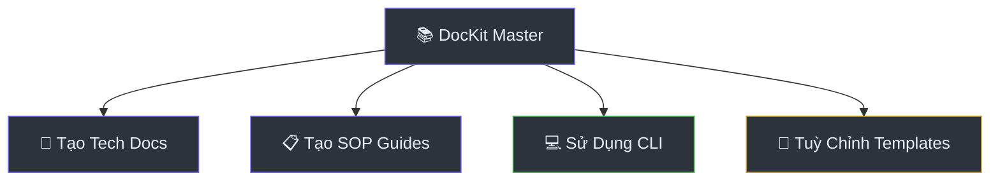

# Hướng Dẫn Sử Dụng

> **Tham Khảo Nhanh**
> - **Tổng tính năng**: 5 hướng dẫn chính
> - **Đối tượng**: Developer, Technical Writer
> - **Thời gian trung bình**: 5-15 phút per guide
> - **Cập nhật**: 2026-02-27

## Sơ Đồ Tính Năng

Sơ đồ dưới mô tả các nhóm tính năng chính và mối quan hệ giữa chúng.

## Danh Sách Hướng Dẫn

| # | Hướng dẫn | Mô tả | Độ khó | Thời gian |
|---|-----------|-------|--------|-----------|
| 1 | [Tạo tài liệu kỹ thuật](./generating-tech-docs) | Sinh architecture, database, deployment, data-flow | 🟡 Trung bình | ~10 phút |
| 2 | [Tạo hướng dẫn SOP](./generating-sop-guides) | Sinh user guides step-by-step | 🟢 Dễ | ~5 phút |
| 3 | [Sử dụng CLI](./using-cli) | Chạy script CLI tương tác | 🟢 Dễ | ~3 phút |
| 4 | [Tuỳ chỉnh templates](./customizing-templates) | Sửa CSS, config, thêm ngôn ngữ | 🟡 Trung bình | ~15 phút |

:::tip[Bắt đầu từ đâu?]
Nếu bạn mới dùng DocKit Master, hãy bắt đầu với [Sử dụng CLI](./using-cli) — cách nhanh nhất để tạo tài liệu đầu tiên.
:::

---

> Xem thêm: [Kiến trúc hệ thống](../architecture) · [Tham chiếu Skill](../api/index)
