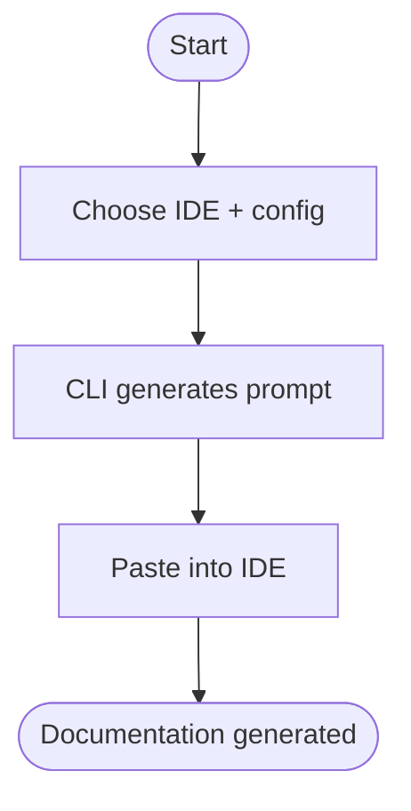

# Using the CLI

> **Quick Reference**
> - **Who**: Developer (any skill level)
> - **Where**: Terminal / Shell
> - **Time**: ~2 minutes to complete
> - **Prerequisites**: Bash 4+, target project path

## Persona Context

> **This guide is for**: [Developer Dana](../personas/user-developer)
>
> **Job To Be Done**: [Configure documentation tooling for team](../jtbd/configure-tooling)
> — _"When my team adopts DocKit Master, I want to generate prompts quickly, so that I can paste them into any IDE."_

## Process Flow



## Prerequisites

- [ ] Bash 4+ installed (macOS: `brew install bash`)
- [ ] Know the absolute path to your target project
- [ ] AI IDE installed (Antigravity, Cursor, Claude, etc.)

## Step-by-Step Guide

### Step 1: Run the CLI

```bash
bash scripts/dockit-master.sh
```

The CLI displays an interactive menu with 6 configuration steps.

### Step 2: Choose Your IDE

Select your target AI coding IDE (1–7). Default is Antigravity.

### Step 3: Choose Document Type

| Option | Description |
|--------|-------------|
| 1 — knowledge | Personas, JTBD, Process Flows |
| 2 — tech | Architecture, Database, Deployment |
| 3 — sop | Step-by-step user guides |
| 4 — api | API endpoint reference |
| 5 — all | Complete documentation suite (recommended) |

### Step 4: Enter Project Path

Provide the absolute path to the project you want to document.

:::tip
Use tab completion to avoid typos. The CLI validates the path exists.
:::

### Step 5: Choose Language and Options

Select output language, SEO optimization, and LLM optimization preferences.

### Step 6: Copy the Generated Prompt

The CLI generates a ready-to-paste prompt and copies it to clipboard (macOS). Paste it into your AI IDE to start generating documentation.

## Expected Results

- Prompt copied to clipboard
- Ready to paste into target IDE
- Documentation generation begins immediately after pasting

<details>
<summary>Troubleshooting: "Directory not found" error</summary>

**Cause:** Invalid project path or path contains special characters.

**Solution:**
1. Use absolute paths (starting with `/`)
2. Quote paths with spaces: `"/path/with spaces/project"`
3. Verify the directory exists: `ls /your/path`

</details>

<details>
<summary>Troubleshooting: "pbcopy not found" (Linux)</summary>

**Cause:** pbcopy is macOS only.

**Solution:** Install xclip: `sudo apt install xclip` and alias: `alias pbcopy='xclip -selection clipboard'`

</details>

## Related

- [Developer Dana](../personas/user-developer)
- [Configure tooling JTBD](../jtbd/configure-tooling)
- [Installation workflow](../flows/wf-installation)
- [Generating Tech Docs](./generating-tech-docs)
