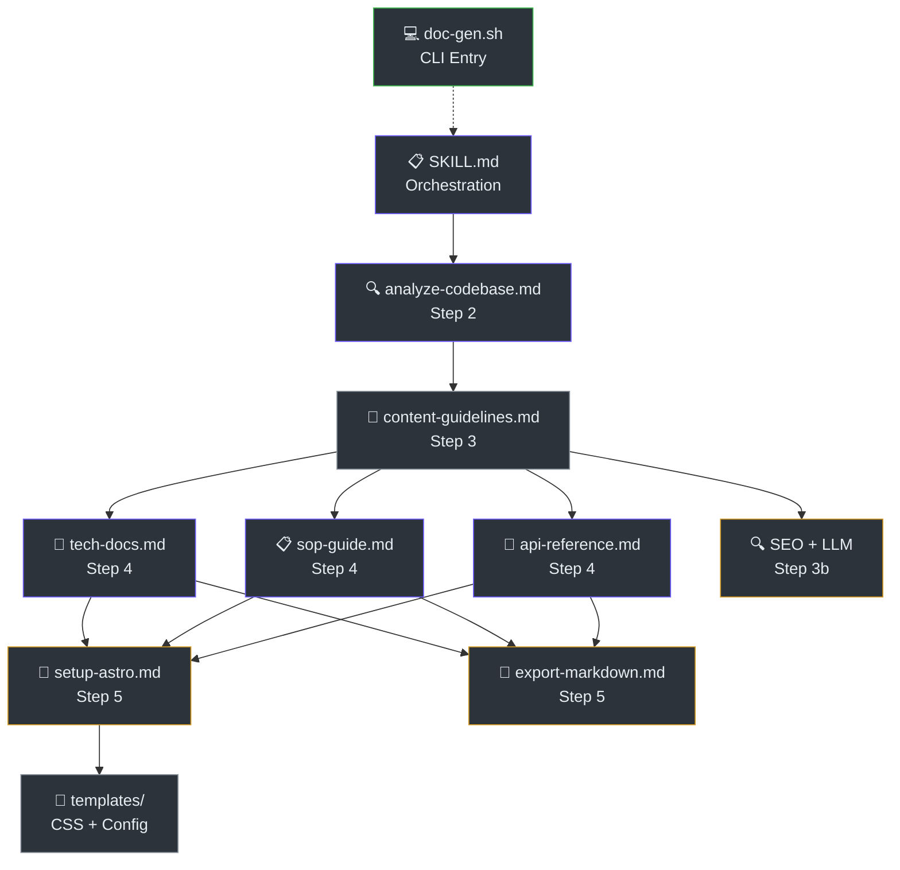
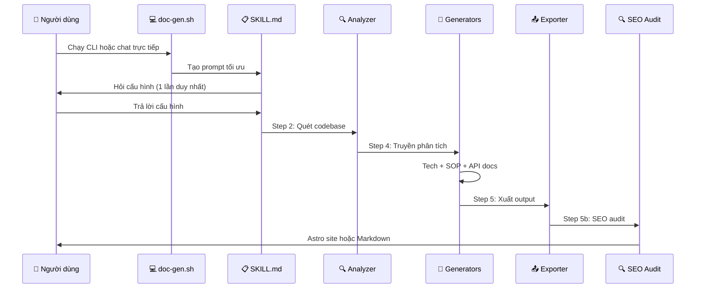

# Phân Tích Mã Nguồn

> **Tham Khảo Nhanh**
> - **Dự án**: DocKit Master — Documentation Toolkit
> - **Loại**: AI Skill / Toolkit (không phải web app hay server)
> - **Ngôn ngữ**: Markdown, Bash, CSS, HTML, JavaScript (Astro config)
> - **Framework**: Google Antigravity Skills System, Astro Starlight
> - **Tổng file**: ~20 file chính
> - **Dòng code ước tính**: ~3,500 dòng

## Kiến Trúc Tổng Quan

DocKit Master sử dụng kiến trúc pipeline 6 bước: từ thu thập input → phân tích code → áp dụng content guidelines → sinh tài liệu → xuất format → tóm tắt kết quả.



## Cấu Trúc Thư Mục

```
doc-kit/
├── SKILL.md                           # Orchestrator chính — 252 dòng
├── README.md                          # Giới thiệu dự án — 92 dòng
├── index.html                         # Landing page premium — 42KB
│
├── skills/                            # Kỹ năng con (sub-skills)
│   ├── analyze-codebase.md            # Phân tích code — 181 dòng
│   ├── content-guidelines.md          # Quy tắc nội dung — 275 dòng
│   ├── content-writing.md             # SEO copywriting — ~200 dòng
│   ├── llm-optimization.md            # AI-readable rules — ~230 dòng
│   ├── seo-checklist.md               # SEO audit — ~160 dòng
│   ├── tech-docs.md                   # Tạo tài liệu kỹ thuật — 318 dòng
│   ├── sop-guide.md                   # Tạo SOP hướng dẫn — 199 dòng
│   └── api-reference.md               # Tạo API reference — 251 dòng
│
├── workflows/                         # Quy trình xuất output
│   ├── generate-docs.md               # Workflow tổng
│   ├── export-markdown.md             # Xuất Markdown
│   ├── setup-astro.md                 # Dựng Astro Starlight ★
│   ├── setup-docusaurus.md            # Dựng Docusaurus (legacy)
│   └── generate-sitemap.md            # Tạo sitemap + robots.txt
│
├── templates/                         # Template sẵn
│   ├── astro-premium/                 # ★ Template chính
│   │   ├── astro.config.mjs           # Config template — 122 dòng
│   │   ├── package.json               # Dependencies
│   │   └── src/styles/custom.css      # Premium CSS — 420 dòng
│   ├── docusaurus-premium/            # Legacy template
│   └── markdown/
│       └── structure.md               # Cấu trúc Markdown
│
├── scripts/
│   └── doc-gen.sh                     # CLI tương tác — 121 dòng
│
└── css/                               # CSS cho landing page
```

## Phân Tích Thành Phần

| Thành phần | File | Vai trò | Dòng |
|------------|------|---------|------|
| Orchestrator | `SKILL.md` | Điều phối toàn bộ quy trình 6 bước + SEO/LLM | 252 |
| Analyzer | `skills/analyze-codebase.md` | Quét code, phát hiện tech stack, trích xuất schema | 181 |
| Content Rules | `skills/content-guidelines.md` | Quy tắc Markdown, Mermaid, UX Laws, SEO frontmatter | 275 |
| SEO Writing | `skills/content-writing.md` | Keyword placement, inverted pyramid, active voice | ~200 |
| LLM Rules | `skills/llm-optimization.md` | AI-readable heading, self-contained sections | ~230 |
| SEO Audit | `skills/seo-checklist.md` | Per-page SEO audit checklist | ~160 |
| Tech Docs | `skills/tech-docs.md` | Tạo architecture, database, deployment, data-flow | 318 |
| SOP Guide | `skills/sop-guide.md` | Tạo hướng dẫn sử dụng từng bước | 199 |
| API Reference | `skills/api-reference.md` | Tạo tài liệu API / skill reference | 251 |
| CLI | `scripts/doc-gen.sh` | Giao diện dòng lệnh tương tác | 121 |
| Premium CSS | `templates/astro-premium/src/styles/custom.css` | Glassmorphism, dark mode, WCAG AA | 420 |
| Astro Config | `templates/astro-premium/astro.config.mjs` | Cấu hình mẫu Astro Starlight | 122 |
| Landing Page | `index.html` | Trang giới thiệu sản phẩm | ~42KB |

## Công Nghệ Phát Hiện

| Tín hiệu | Phát hiện |
|-----------|-----------|
| `SKILL.md` với YAML frontmatter | Google Antigravity Skill |
| `astro.config.mjs` + `@astrojs/starlight` | Astro Starlight (output format) |
| `@astrojs/sitemap` | Sitemap integration |
| `custom.css` với CSS custom properties | Design system tùy chỉnh |
| `doc-gen.sh` với bash | CLI macOS (pbcopy) |
| `index.html` với inline CSS | Landing page tĩnh |

## Quy Trình Chính (Pipeline)

Sơ đồ dưới đây mô tả luồng xử lý chính của DocKit Master, từ input người dùng đến output cuối cùng.



## UX Principles Đã Áp Dụng

| Luật UX | Áp Dụng Trong |
|---------|---------------|
| Hick's Law | ≤7 mục TOC, progressive disclosure (`content-guidelines.md`) |
| Miller's Law | Chunk 5-9 items (`content-guidelines.md`) |
| Doherty Threshold | 200ms transitions, tables (`custom.css:206-213`) |
| Jakob's Law | Layout sidebar chuẩn (`content-guidelines.md`) |
| Fitts's Law | Touch targets ≥44px (`custom.css:107-113`) |
| WCAG 2.1 AA | Focus-visible, contrast, reduced motion (`custom.css:318-342`) |

## Kiểm Tra

| Hạng mục | Kết quả |
|----------|---------|
| Framework test | Không có (skill dạng prompt/template) |
| Build test | Astro `npm run build` |
| Linting | Content rules trong `content-guidelines.md` |
| SEO audit | `seo-checklist.md` per-page audit |

---

> Xem thêm: [Kiến trúc hệ thống](./architecture.md) · [Hướng dẫn triển khai](./deployment.md)
