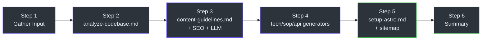

# Orchestrator — SKILL.md

> **Tham Khảo Nhanh**
> - **File**: `SKILL.md` (252 dòng)
> - **Vai trò**: Entry point, điều phối toàn bộ quy trình
> - **Input**: Câu hỏi cấu hình từ người dùng
> - **Output**: Gọi các skill con theo thứ tự

## Mô Tả

`SKILL.md` là file chính của DocKit Master. Khi người dùng trigger skill (chat hoặc CLI), file này:

1. **Hiển thị form cấu hình** — 10 câu hỏi trong 1 message duy nhất
2. **Auto-generate execution plan** — Map câu trả lời thành config
3. **Gọi skill con** — Tuần tự theo pipeline 6 bước
4. **Tổng hợp kết quả** — Trình bày danh sách file và next steps

## Cấu Hình (Step 1)

Orchestrator thu thập 10 tham số:

| Tham số | Kiểu | Mặc định | Mô tả |
|---------|------|----------|-------|
| `DOC_TYPE` | enum | `all` | `tech` · `sop` · `api` · `all` |
| `FORMAT` | enum | `astro` | `markdown` · `astro` |
| `SCOPE` | enum | `full` | `full` · `focused` |
| `FOCUS_TARGET` | string | null | Thư mục/module (nếu focused) |
| `LANGUAGE` | string | auto | Auto-detect từ ngôn ngữ chat |
| `I18N` | bool | `no` | Đa ngôn ngữ (astro only) |
| `RECORD` | bool | `no` | Quay video walkthrough |
| `PROJECT_PATH` | string | workspace | Đường dẫn project |
| `SEO` | bool | `yes` | SEO optimization |
| `LLM_OPTIMIZE` | bool | `yes` | AI/LLM optimization |

## Pipeline Gọi Skill

## Quy Tắc Quan Trọng

- **Hỏi tất cả trong 1 message** — không hỏi từng câu
- **Auto-detect language** — xác định từ ngôn ngữ chat
- **Auto-proceed** — sau khi lên plan, chạy ngay Step 2 (không chờ approve)
- **Filename conventions** — kebab-case, no underscore prefix
- **SEO default on** — `robots: "index, follow"` cho tất cả trang

**Source:** `SKILL.md:41-118` (Step 1), `SKILL.md:120-130` (Step 2)

---

> Xem thêm: [Analyzer](./analyze-codebase) · [Content Guidelines](./content-guidelines)
