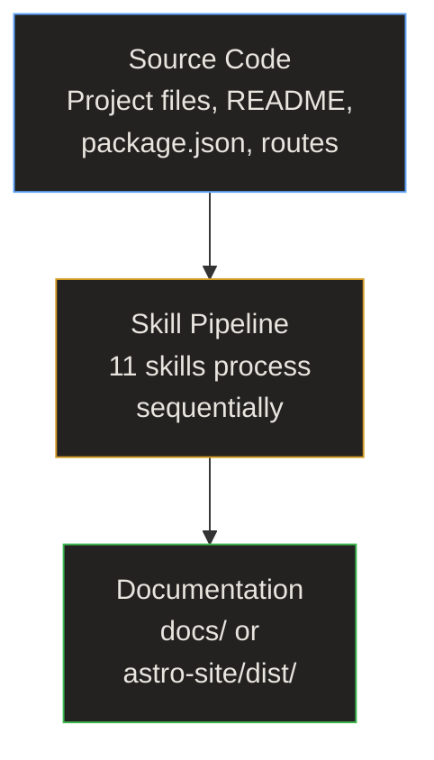
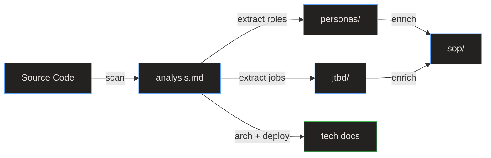
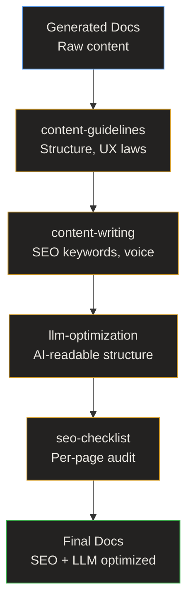

# Data Flow

> **Quick Reference**
> - **Pattern**: Sequential pipeline (each step reads previous output)
> - **Protocol**: File system (Markdown read/write)
> - **Serialization**: YAML frontmatter + Markdown body

## End-to-End Data Flow

**Flow summary:** Source code enters the pipeline, is processed by 11 skills sequentially, and exits as structured documentation files.

## Detailed Pipeline Flow

**Pipeline data flow:** Source code is scanned into analysis.md. From analysis, roles are extracted into personas and jobs into JTBD canvases. These knowledge artifacts then enrich the SOP guides. Technical docs are generated directly from the analysis.

## Data Transformation Details

| Stage | Input | Transform | Output | Size |
|-------|-------|-----------|--------|------|
| Analysis | Project files | Scan, detect, map | analysis.md | ~8 KB |
| Personas | analysis.md + source code | Extract roles, build profiles | 5 files | ~15 KB |
| JTBD | analysis.md + personas | Extract jobs, build canvases | 4 files | ~10 KB |
| Flows | analysis.md + personas + JTBD | Map processes, draw diagrams | 6 files | ~12 KB |
| Tech Docs | analysis.md | Generate architecture, DB, deploy | 4 files | ~20 KB |
| SOPs | All above | Enrich with knowledge context | 5+ files | ~15 KB |
| API Ref | analysis.md | Document skill interfaces | 4+ files | ~10 KB |
| Export | All docs | Copy + build | astro-site/dist/ | ~5 MB |

## Quality Layer Data Flow

**Quality flow summary:** Raw documentation passes through four quality filters: structural guidelines, SEO writing rules, LLM optimization, and a final SEO audit before export.

## Related

- [System Architecture](./architecture)
- [Skill pipeline workflow](./flows/wf-skill-pipeline)
- [Deployment Guide](./deployment)
