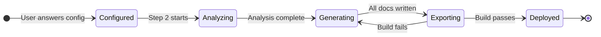

# Documentation Project — Lifecycle

> **Quick Reference**
> - **Entity**: Documentation Project
> - **States**: 5 states
> - **Transitions**: 6 transitions
> - **Terminal States**: Deployed, Abandoned

## State Diagram

**Lifecycle summary:** A documentation project begins when the user provides configuration. It moves through analysis, generation, and export phases. If the Astro build fails, it returns to generation for fixes. Successfully built projects are deployed.

## Transition Table

| From | To | Trigger | Condition |
|------|----|---------|-----------|
| Start | Configured | User answers 10 config questions | All required fields provided |
| Configured | Analyzing | SKILL.md starts Step 2 | Valid project path |
| Analyzing | Generating | analysis.md written | Codebase scanned successfully |
| Generating | Exporting | All doc files created | Frontmatter valid on all files |
| Exporting | Deployed | `npm run build` passes | Exit code 0 |
| Exporting | Generating | Build fails | Missing title, broken links |

## State Details

| State | Description | Duration |
|-------|------------|----------|
| Configured | User input gathered, ready to analyze | Seconds |
| Analyzing | Scanning codebase structure | 1–3 minutes |
| Generating | Writing all documentation files | 5–15 minutes |
| Exporting | Building Astro site or organizing Markdown | 1–2 minutes |
| Deployed | Site live and accessible | Persistent |

## Related

- [Skill pipeline workflow](./wf-skill-pipeline)
- [Generating tech docs SOP](../sop/generating-tech-docs)
- [System Architecture](../architecture)
