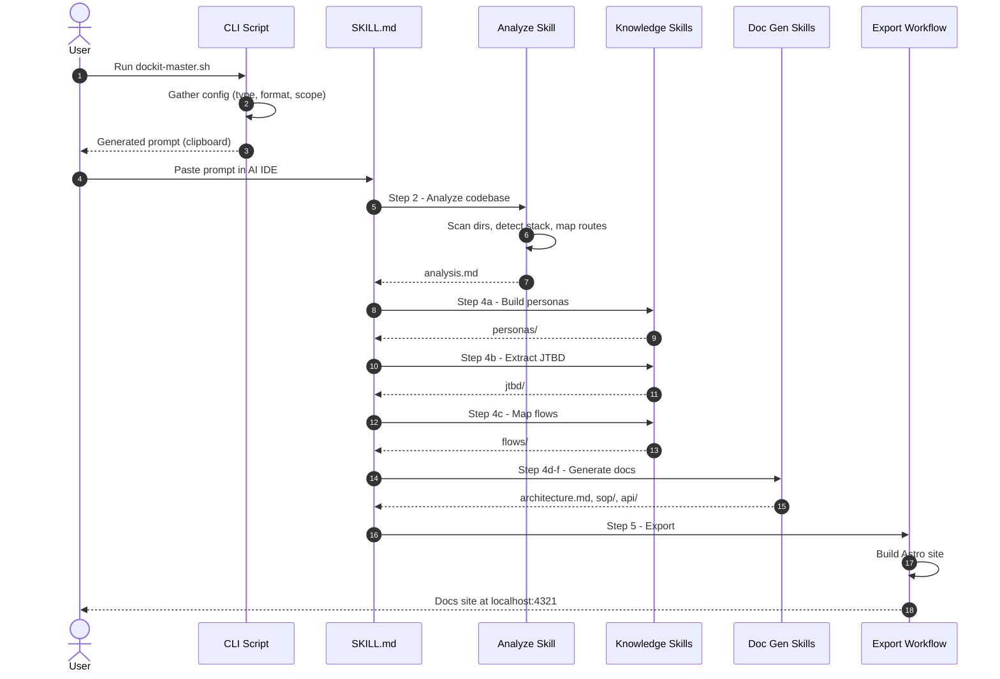

# Documentation Generation — Sequence Flow

> **Quick Reference**
> - **Trigger**: User invokes DocKit Master in AI IDE
> - **Components**: 6 participants
> - **Total Steps**: 14

## Sequence Diagram

**Sequence summary:** The user runs the CLI to generate a prompt, pastes it into their AI IDE, and the SKILL.md orchestrator sequentially invokes analysis, knowledge, documentation, and export skills. Each skill reads previous output for enrichment.

## Interaction Details

| # | From | To | Action |
|---|------|----|--------|
| 1 | User | CLI | Run dockit-master.sh |
| 2 | CLI | CLI | Gather 6 config parameters |
| 3 | CLI | User | Copy prompt to clipboard |
| 4 | User | SKILL.md | Paste prompt in AI IDE |
| 5-7 | SKILL.md | Analyze | Scan, detect, map |
| 8-10 | SKILL.md | Knowledge | Personas, JTBD, Flows |
| 11-12 | SKILL.md | Doc Gen | Tech, SOP, API |
| 13-14 | SKILL.md | Export | Build and serve |

## Related

- [Skill pipeline workflow](./wf-skill-pipeline)
- [AI Agent Alex](../personas/user-ai-agent)
- [Systematize knowledge JTBD](../jtbd/systematize-knowledge)
