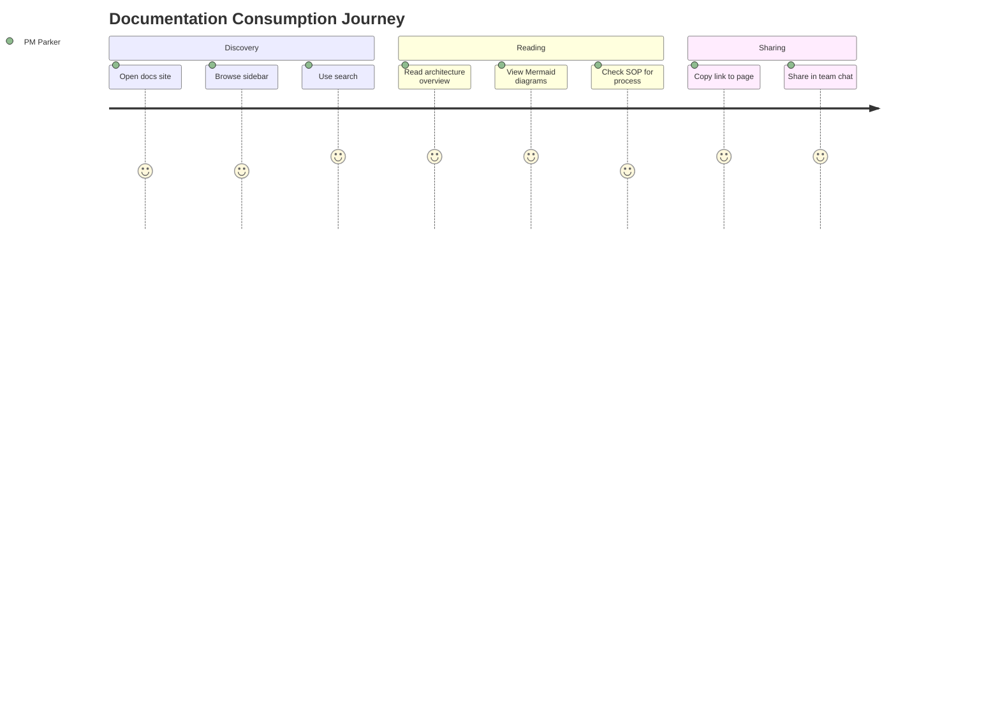

# Documentation Consumption — User Journey

> **Quick Reference**
> - **Persona**: [PM Parker](../personas/user-product-manager)
> - **JTBD**: [Consume and share documentation](../jtbd/consume-documentation)
> - **Duration**: ~10 minutes per session
> - **Steps**: 8 steps

## Journey Map

**Journey summary:** PM Parker opens the Astro Starlight documentation site, browses the auto-generated sidebar or uses Pagefind search to find relevant pages. They read architecture overviews and flow diagrams, then share links with team members via chat or email.

## Journey Details

| Phase | Step | Page/Screen | Satisfaction | Opportunity |
|-------|------|------------|:-----------:|-------------|
| Discovery | Open docs site | Landing page | 4/5 | Clear entry point |
| Discovery | Browse sidebar | Auto-sidebar | 4/5 | Logical grouping |
| Discovery | Use search | Pagefind search | 5/5 | Built-in, fast |
| Reading | Architecture overview | architecture.md | 5/5 | Mermaid diagrams |
| Reading | View diagrams | Rendered SVG | 5/5 | Dark-mode compatible |
| Reading | Check SOP | sop/*.md | 4/5 | Progressive disclosure |
| Sharing | Copy link | URL bar | 5/5 | Clean URLs |
| Sharing | Share in chat | External | 5/5 | Works as preview |

## Related

- [PM Parker](../personas/user-product-manager)
- [Consume documentation JTBD](../jtbd/consume-documentation)
- [User Guides overview](../sop/)
