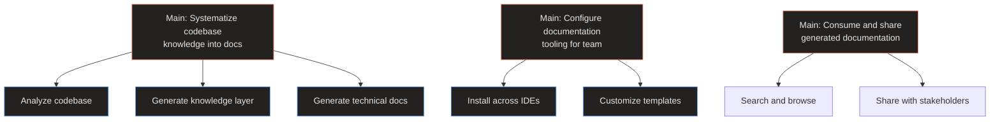

# Jobs To Be Done

> **Quick Reference**
> - **Main Jobs**: 3
> - **Small Jobs**: 9
> - **Micro-jobs**: 27+
> - **Framework**: GitLab JTBD (Main → Small → Micro)
> - **Last Updated**: 2026-02-28

## Job Hierarchy Overview

**Hierarchy summary:** DocKit Master serves three main jobs: (1) transforming code into structured knowledge, (2) setting up the tooling for development teams, and (3) consuming the output for decisions and communication.

## Job Directory

| # | Main Job | Performer | Small Jobs | Canvas |
|---|---------|-----------|-----------|--------|
| 1 | Systematize codebase knowledge into structured documentation | [AI Agent Alex](../personas/user-ai-agent) | 4 | [View](./systematize-knowledge) |
| 2 | Configure documentation tooling for development team | [Developer Dana](../personas/user-developer) | 3 | [View](./configure-tooling) |
| 3 | Consume and share generated documentation | [PM Parker](../personas/user-product-manager) | 2 | [View](./consume-documentation) |

## Persona - Job Matrix

| Persona | Systematize Knowledge | Configure Tooling | Consume Docs |
|---------|:-:|:-:|:-:|
| AI Agent Alex | Primary | — | — |
| Developer Dana | Related | Primary | Related |
| PM Parker | — | — | Primary |
| Tech Lead Taylor | Related | Related | Related |

## Related

- [Personas overview](../personas/)
- [Process Flows](../flows/)
- [System Architecture](../architecture)
