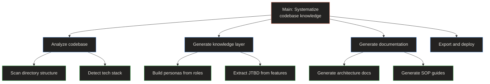

# Systematize Codebase Knowledge into Structured Documentation

> **Quick Reference**
> - **Job Performer**: [AI Agent Alex](../personas/user-ai-agent)
> - **Job Type**: Core
> - **Frequency**: On-demand (per project)
> - **Complexity**: Complex

## Canvas

### Job Statement

> **When** a development team has an undocumented or poorly documented codebase,
> **I want to** analyze the code and generate comprehensive documentation automatically,
> **so that** the team has a complete, searchable knowledge base without manual writing effort.

### Situation and Trigger

> The team realizes documentation is missing or outdated. A new hire joins and cannot find answers. A senior engineer leaves and takes institutional knowledge with them.
>
> **Trigger event**: User runs `dockit-master.sh` or invokes the `/DocKit Master` command in their AI IDE (`scripts/dockit-master.sh:1`)

### Current Alternatives

| Alternative | Pros | Cons |
|------------|------|------|
| Manual documentation | Full control over content | Time-consuming, always outdated |
| README generators | Quick setup | Shallow — no personas, flows, JTBD |
| Swagger/OpenAPI | Good for API docs | No SOP guides, no architecture docs |
| GitHub Copilot docs | AI-powered | No structured knowledge layer |

### Expected Outcome

- Complete documentation suite: personas, JTBD, flows, architecture, SOP, API
- SEO-optimized pages that rank in search engines
- LLM-readable content for AI research tools like NotebookLM
- Professional Astro Starlight site with search, dark mode, and sidebar navigation

## Job Map

**Job map summary:** The main job decomposes into four small jobs — analyze, build knowledge, generate docs, and export. Each small job contains specific micro-jobs that map to individual skill files.

### Job Steps

| Step | Small Job | Micro-jobs | Source |
|------|-----------|-----------|--------|
| 1 | Analyze codebase | Scan dirs, detect stack, map routes, extract schema | `skills/analyze-codebase.md:7-56` |
| 2 | Generate knowledge | Build personas, extract JTBD, map flows | `skills/persona-builder.md`, `skills/jtbd-analyzer.md`, `skills/flow-mapper.md` |
| 3 | Generate documentation | Architecture, database, deployment, SOP, API | `skills/tech-docs.md`, `skills/sop-guide.md`, `skills/api-reference.md` |
| 4 | Export and deploy | Build Astro site, generate sitemap, run SEO audit | `workflows/setup-astro.md`, `workflows/generate-sitemap.md` |

## Related

- **Persona**: [AI Agent Alex](../personas/user-ai-agent)
- **Flow**: [Skill pipeline workflow](../flows/wf-skill-pipeline)
- **SOP**: [Generating tech docs](../sop/generating-tech-docs)
