# Analyze Codebase — UX Master Edition

Deeply analyze the codebase to create metadata for other documentation generation skills. Produces a comprehensive analysis with architecture diagrams, dependency graphs, and framework detection.

## Procedure

### 1. Scan Project Root

```
- Read README.md, package.json, Makefile, docker-compose.yml, etc.
- List all top-level directories
- Count files by extension to detect languages
- Identify monorepo structure if applicable
```

### 2. Detect Tech Stack

| Signal | Detected As |
|--------|------------|
| `package.json` + `next.config.*` | Next.js |
| `package.json` + `vite.config.*` | Vite + React/Vue |
| `package.json` + `nuxt.config.*` | Nuxt.js |
| `package.json` + `svelte.config.*` | SvelteKit |
| `package.json` + `astro.config.*` | Astro |
| `requirements.txt` / `pyproject.toml` | Python |
| `go.mod` | Go |
| `Cargo.toml` | Rust |
| `pom.xml` / `build.gradle` | Java |
| `*.csproj` | .NET/C# |
| `docker-compose.yml` | Containerized |
| `Dockerfile` | Docker |
| `deno.json` / `deno.jsonc` | Deno |
| `bun.lockb` / `bunfig.toml` | Bun |
| `tauri.conf.json` | Tauri |
| `electron-builder.yml` | Electron |
| `Makefile` | Build automation |
| `setup.py` / `setup.cfg` | Python package |

### 3. Map Architecture

Identify and document:

1. **Presentation Layer** — Routes, pages, components, views
2. **Business Logic** — Services, controllers, handlers, middleware
3. **Data Layer** — Models, migrations, repositories, ORM config
4. **Infrastructure** — Config, Docker, CI/CD, deployment scripts
5. **External Integrations** — API clients, webhooks, SDKs
6. **Testing** — Test framework, test directories, coverage config

### 4. Identify Key Entry Points

- Web server startup file (e.g., `index.ts`, `main.py`, `main.go`, `app.py`)
- Route registration files
- Database migration files
- Environment/config files
- CLI entry points (`bin/`, `scripts/`)

### 5. Extract Route Map

Scan route/controller files and build a table:

| Method | Path | Handler | Auth | Middleware | Description |
|--------|------|---------|------|------------|-------------|
| GET | /api/users | getUsers | Yes | rateLimit | List users |
| POST | /api/users | createUser | Yes | validate | Create user |

### 6. Extract Database Schema

From migration files or ORM models, build:

- Table list with columns, types, and constraints
- Relationships (FK, many-to-many, polymorphic)
- Indexes and unique constraints
- Enum types

### 7. Analyze Dependencies

Build a dependency overview:

| Category | Package | Version | Purpose |
|----------|---------|---------|---------|
| Core | express | 4.18 | HTTP server |
| Database | prisma | 5.0 | ORM |
| Auth | jsonwebtoken | 9.0 | JWT handling |
| Testing | jest | 29.0 | Unit tests |

### 8. Detect Test Coverage

- Identify test framework (Jest, Pytest, Go test, etc.)
- Count test files vs source files
- Note CI/CD test integration

### 9. Output

Generate `docs/analysis.md` (note: NO underscore prefix for MDX compatibility) with all findings:

```markdown
---
title: "Codebase Analysis"
description: "Automated analysis of the project codebase"
sidebar_position: 99
---

# Codebase Analysis

> **Quick Reference**
> - **Project**: [name from package.json/README]
> - **Type**: [Web App / API / Library / CLI / SDK]
> - **Languages**: [TypeScript, Python, etc.]
> - **Frameworks**: [Next.js, FastAPI, etc.]
> - **Lines of Code**: ~[estimate]

## Architecture

```mermaid
graph TB
    style UI fill:#2d333b,stroke:#6d5dfc,color:#e6edf3
    style API fill:#2d333b,stroke:#6d5dfc,color:#e6edf3
    style DB fill:#2d333b,stroke:#3fb950,color:#e6edf3

    subgraph Presentation
        UI["🖥️ Frontend"]
    end

    subgraph Business
        API["⚙️ API Server"]
    end

    subgraph Data
        DB["🗄️ Database"]
    end

    UI --> API --> DB
```



## Directory Structure

```
[Annotated tree — show only important directories]
```

## Dependencies

| Category | Package | Version | Purpose |
|----------|---------|---------|---------|

## Route Map

| Method | Path | Handler | Auth | Description |
|--------|------|---------|------|-------------|

## Database Schema

| Table | Columns | Relationships |
|-------|---------|---------------|

## Key Files

| File | Role | Lines |
|------|------|-------|
| src/index.ts | Entry point | 150 |
| src/routes/ | API routes | — |

## Test Coverage

| Framework | Test Files | Coverage |
|-----------|-----------|----------|
```

## Rules

- **TRACE actual code** — never guess from filenames
- **Cite every finding**: `(file_path:line_number)`
- **Output file**: `analysis.md` (**NOT** `_analysis.md` — underscore breaks MDX)
- Use Mermaid diagrams with dark-mode colors:
  - Node fill: `#2d333b`, border: `#6d5dfc`, text: `#e6edf3`
  - Background: `#161b22`, Success: `#3fb950`
- If a section cannot be determined, state **"Undetermined — requires further inspection"**
- **Quick Reference card** at top of output
- **Include dependency analysis** — essential for understanding the project
