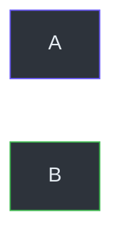

# Content Quality Guidelines — UX Master Edition

Rules for generating documentation content that is readable, scannable, SEO-optimized, and compatible with Astro Starlight.

## Companion Skill Files

This file covers structure and formatting. For specialized guidance, also read:

| Skill | File | Purpose |
|-------|------|---------|
| **SEO Checklist** | `skills/seo-checklist.md` | Per-page SEO audit after generation |
| **Content Writing** | `skills/content-writing.md` | SEO copywriting, keywords, active voice |
| **LLM Optimization** | `skills/llm-optimization.md` | AI-readable structure, NotebookLM-ready |

## UX Laws for Documentation

### Hick's Law — Reduce Decision Complexity

- **Max 7 items** in any Table of Contents (TOC) top level
- **Max 2 primary CTAs** per page (e.g., "Get Started" + "View API")
- Group related items into categories — never flat-list >10 items
- Use **sidebar categories** (folders) instead of one long sidebar

### Miller's Law — Chunk Information

- **Chunk tables** into groups of 5-9 rows with section headers
- **Break long pages** into sub-pages if >500 lines
- Use **visual separators**: `---`, headings, or admonition boxes
- Each section should be independently scannable

### Doherty Threshold — Optimize for Scanning

- **Lead with a summary** — put the most important info first
- **Use tables** instead of long paragraphs for structured data
- **Bold key terms** in definitions and descriptions
- **Code examples** should be runnable as-is (copy-paste friendly)

### Jakob's Law — Follow Familiar Patterns

- Use **standard doc layouts**: sidebar left, content center, TOC right
- Use **conventional heading hierarchy**: H1 (title) → H2 (sections) → H3 (subsections)
- Use **standard admonition types**: tip, note, caution, danger

---

## Markdown Rules (Astro Starlight)

Starlight uses **pure Markdown** — no special escaping needed!

### Characters — No Escaping Required

Unlike Docusaurus MDX, Starlight handles raw Markdown natively:
- `<` in text — works fine, no escaping needed
- `{` and `}` in text — works fine, no escaping needed
- HTML tags in Markdown — works as expected

### Filenames

| Rule | ✅ Correct | ❌ Wrong |
|------|-----------|---------| 
| **kebab-case** | `getting-started.md` | `Getting_Started.md` |
| **No underscore prefix** | `analysis.md` | `_analysis.md` |
| **No dots in names** | `deploy-guide.md` | `Deploy.vi.md` |
| **Lowercase only** | `api-reference.md` | `API_Reference.md` |

### Frontmatter (Required)

Every `.md` file MUST include at minimum:

```yaml
---
title: "Descriptive Page Title"
description: "Brief 1-line description for SEO (150-160 chars)"
---
```

### SEO Frontmatter (Recommended)

For SEO-optimized pages, include the full template:

```yaml
---
title: "Page Title — Primary Keyword"        # 50-60 chars
description: "Compelling description with CTA"  # 150-160 chars
keywords: ["primary keyword", "related term", "technology"]  # 3-5 terms
robots: "index, follow"        # SEO indexing control (see below)
canonical: ""                  # Set if page has duplicates
og_title: ""                   # Open Graph title (defaults to title)
og_description: ""             # Open Graph description
og_type: "article"             # article | website
sidebar:
  order: 1                     # Controls sidebar position
  badge:
    text: New                  # Badge on sidebar item
    variant: tip               # tip, note, caution, danger
last_updated: "2026-02-27"     # Freshness signal for SEO
---
```

### Follow / Nofollow Control

The `robots` frontmatter field controls search engine behavior. **Default is `"index, follow"`** (fully SEO-enabled).

| Value | Meaning | Use For |
|-------|---------|--------|
| `"index, follow"` | Crawl page + follow links ✅ | **Default** — all public docs |
| `"noindex, nofollow"` | Don't index, don't follow | Drafts, internal SOPs, admin pages |
| `"index, nofollow"` | Index page but don't follow links | Pages with untrusted outbound links |
| `"noindex, follow"` | Don't index but follow links | Duplicate content, redirect pages |

:::tip[Default Behavior]
If `robots` is omitted from frontmatter, the page defaults to `"index, follow"` — search engines will crawl and index normally.
:::

### Links

- Use **relative paths**: `[API](./api-reference.md)` not absolute
- **Anchor links** must match actual heading slugs
- **No `<a>` tags** — use Markdown `[text](url)` syntax

---

## Content Structure Rules

### Quick Reference Card (Required for tech docs)

Every technical document MUST start with a summary box:

```markdown
> **Quick Reference**
> - **What**: Brief description of this system/feature
> - **Stack**: Python 3.10+, PyTorch 2.0, CUDA 12
> - **Key Files**: `src/engine.py`, `src/model.py`
> - **Status**: Production / Beta / Experimental
```

### Admonitions (Starlight Built-in)

Starlight uses the same `:::type` syntax:

```markdown
:::tip[Performance Tip]
Use batch processing for >100 items — 3x faster than sequential.
:::

:::caution[Breaking Change]
This API changed in v2.0. See migration guide.
:::

:::danger[Security]
Never expose API keys in client-side code.
:::

:::note
This feature requires Python 3.10 or later.
:::
```

**Available types:** `note`, `tip`, `caution`, `danger`

### Progressive Disclosure (For Advanced Content)

Hide advanced/optional content behind expandable sections:

```markdown
<details>
<summary>Advanced Configuration Options</summary>

| Option | Default | Description |
|--------|---------|-------------|
| `batch_size` | 32 | Processing batch size |
| `num_workers` | 4 | Parallel worker count |

</details>
```

### Tabbed Content (For Multi-Platform)

Starlight supports tabs via the `<Tabs>` component (requires MDX file extension `.mdx`):

```mdx
import { Tabs, TabItem } from '@astrojs/starlight/components';

<Tabs>
  <TabItem label="macOS">
    ```bash
    brew install myapp
    ```
  </TabItem>
  <TabItem label="Linux">
    ```bash
    apt-get install myapp
    ```
  </TabItem>
</Tabs>
```

> **Note:** Tabs require `.mdx` file extension. For pure `.md` files, use `<details>` sections instead.

---

## Mermaid Diagram Rules

### Dark-Mode Color Palette

Always use these colors for Mermaid diagrams:

```
Node fill:     #2d333b
Node border:   #6d5dfc  
Node text:     #e6edf3
Background:    #161b22
Edge lines:    #8b949e
Highlight:     #8a7efd
Success:       #3fb950
Warning:       #d29922
Danger:        #f85149
```

### Style Syntax



### Minimum Requirements

- **Architecture docs**: ≥ 2 Mermaid diagrams (overview + sequence)
- **Data flow docs**: ≥ 3 Mermaid diagrams
- **SOP guides**: ≥ 1 Mermaid flowchart of the process

---

## Writing Style

| Rule | ✅ Do | ❌ Don't |
|------|------|---------| 
| **Lead with WHY** | "Use streaming for real-time apps" | "The streaming module provides..." |
| **Active voice** | "Install the package" | "The package should be installed" |
| **Concrete examples** | "Set `batch_size=64` for GPUs with ≥8GB VRAM" | "Adjust batch size as needed" |
| **Cite sources** | `(src/engine.py:42)` | "In the engine file" |
| **Tables > paragraphs** | Use tables for comparisons | Write long comparison paragraphs |

> For detailed SEO writing rules, keyword placement, and content structure, see `skills/content-writing.md`.

---

## Internal Linking Rules

Every page MUST include **≥2 internal links** to other documentation pages.

| Location | Example |
|----------|---------|
| Quick Reference box | `See [Database](./database.md)` |
| Body text (contextual) | `...uses the [auth flow](./data-flow.md#authentication)` |
| Related section (bottom) | `## Related\n- [Architecture](./architecture.md)` |
| Admonition tips | `:::tip\nSee [Deploy Guide](./deployment.md)\n:::` |

**Anchor text rules:** Always use descriptive text, never "click here" or "read more".

---

## LLM Optimization

For making docs AI-readable and NotebookLM-friendly, follow `skills/llm-optimization.md`.

Key rules:
- Every Mermaid diagram has a text description nearby
- Sections are self-contained (≤500 words each)
- Consistent terminology throughout (refer to glossary)
- Code blocks always specify language tag
- No broken Unicode characters
