# Flow Mapper — Knowledge Systematization Engine

Tự động phân tích source code để tạo **4 loại Process Flow diagrams** bằng Mermaid code. Quy trình hoá toàn bộ hệ thống từ business logic, API interactions, entity lifecycles, đến user journeys.

## Input Required

- `docs/analysis.md` (output from analyze-codebase)
- `docs/personas/` (output from persona-builder — nếu đã chạy)
- `docs/jtbd/` (output from jtbd-analyzer — nếu đã chạy)
- Access to source code (routes, controllers, services, models, middleware)

## Content Guidelines

**Before generating, read these skill files:**
- `skills/content-guidelines.md` — Structure, frontmatter, SEO fields
- `skills/content-writing.md` — SEO copywriting, keyword placement
- `skills/llm-optimization.md` — AI-readable structure

## 4 Flow Types

| # | Flow Type | Mermaid Syntax | Mục đích | Source Code Signal |
|---|-----------|---------------|----------|-------------------|
| 1 | **Workflow** | `graph TB` / `graph LR` | Luồng nghiệp vụ tổng quan | Route → Controller → Service → DB |
| 2 | **Sequence** | `sequenceDiagram` | Tương tác giữa components theo thời gian | API calls, middleware chain, external APIs |
| 3 | **Stage/Lifecycle** | `stateDiagram-v2` | Vòng đời entity, trạng thái chuyển đổi | Status enums, FSMs, order states |
| 4 | **User Journey** | `journey` | Hành trình trải nghiệm người dùng | UI routes, page navigation, onboarding |

## Procedure

### 1. Generate Workflow Diagrams

**Source**: Route handlers → Controllers → Services → Repositories

Scan pattern:
```
Route file → find handler function
Handler → find service calls
Service → find DB operations
Service → find external API calls
```

Template:

```markdown
---
title: "[Module] — Workflow"
description: "Business workflow diagram for [module]"
keywords: ["workflow", "[module]", "process flow"]
robots: "index, follow"
sidebar:
  order: [number]
---

# 🔄 [Module Name] — Workflow

> **Quick Reference**
> - **Persona**: [Who performs this workflow](../personas/user-name.md)
> - **JTBD**: [Related job statement](../jtbd/job-name.md)
> - **Trigger**: [What initiates this workflow]
> - **Outcome**: [What is the end result]

## Process Flow

```mermaid
graph TB
    style Start fill:#232221,stroke:#3fb950,color:#E8E5DF
    style End fill:#232221,stroke:#3fb950,color:#E8E5DF
    style Decision fill:#232221,stroke:#f78166,color:#E8E5DF

    Start(["▶ Trigger: [Event]"])
    A["Step 1: [Action]"]
    B["Step 2: [Action]"]
    Decision{"Condition?"}
    C["Step 3a: [If yes]"]
    D["Step 3b: [If no]"]
    End(["✅ Outcome: [Result]"])

    Start --> A --> B --> Decision
    Decision -->|"Yes"| C --> End
    Decision -->|"No"| D --> End
```



## Step Details

| Step | Action | Component | Source |
|------|--------|-----------|--------|
| 1 | [Action] | `[controller.method]` | `(file:line)` |
| 2 | [Action] | `[service.method]` | `(file:line)` |

## Related
- **SOP**: [Link to SOP](../sop/module-name.md)
- **Persona**: [Link to Persona](../personas/user-name.md)
```

### 2. Generate Sequence Diagrams

**Source**: Middleware chain → Handler → Service → External APIs → DB → Response

Scan pattern:
```
Request → middleware stack (auth, validation, rate-limit)
Handler → service method calls (in order)
Service → DB queries + external API calls
Response → serialization → client
```

Template:

```markdown
---
title: "[Feature] — Sequence Flow"
description: "Sequence diagram showing component interactions for [feature]"
keywords: ["sequence diagram", "[feature]", "API flow"]
robots: "index, follow"
sidebar:
  order: [number]
---

# ⏱️ [Feature Name] — Sequence Flow

> **Quick Reference**
> - **Trigger**: [API call / User action / Scheduled event]
> - **Components**: [count] participants
> - **Total Steps**: [count]

## Sequence Diagram

```mermaid
sequenceDiagram
    autonumber
    
    actor User
    participant FE as 🖥️ Frontend
    participant API as ⚙️ API Server
    participant Auth as 🔐 Auth Service
    participant DB as 🗄️ Database

    User->>FE: [User action]
    FE->>API: [API call — METHOD /path]
    
    API->>Auth: Verify token
    Auth-->>API: Token valid
    
    API->>DB: [Query description]
    DB-->>API: [Result]
    
    API-->>FE: [Response — status code]
    FE-->>User: [UI update]
```



## Interaction Details

| # | From | To | Action | Source |
|---|------|----|--------|--------|
| 1 | User | Frontend | [action] | `(file:line)` |
| 2 | Frontend | API | `METHOD /path` | `(file:line)` |
```

### 3. Generate Stage/Lifecycle Diagrams

**Source**: Status enums, state machines, order/ticket lifecycles

Scan pattern:
```
Search for: enum Status, state fields, status columns
Find: transition functions, status update methods
Map: allowed transitions, guard conditions
```

Template:

```markdown
---
title: "[Entity] Lifecycle — Stage Flow"
description: "State transitions and lifecycle stages for [entity]"
keywords: ["lifecycle", "state diagram", "[entity]"]
robots: "index, follow"
sidebar:
  order: [number]
---

# 🔁 [Entity Name] — Lifecycle

> **Quick Reference**
> - **Entity**: [Entity name from DB model]
> - **States**: [count] states
> - **Transitions**: [count] transitions
> - **Terminal States**: [list]

## State Diagram


## Transition Table

| From | To | Trigger | Guard Condition | Handler | Source |
|------|----|---------|----------------|---------|--------|
| Draft | Pending | User clicks Submit | All required fields filled | `submitOrder()` | `(file:line)` |
| Pending | Approved | Admin clicks Approve | Has permission `approve` | `approveOrder()` | `(file:line)` |

## State Details

| State | Description | Allowed Actions | Who Can Act |
|-------|------------|-----------------|------------|
| Draft | Initial state after creation | Edit, Delete, Submit | Creator |
| Pending | Awaiting approval | Approve, Reject | Admin |
```

### 4. Generate User Journey Maps

**Source**: Route structure, page transitions, navigation flow, onboarding

Scan pattern:
```
Search for: page routes, navigation links, wizard/stepper components
Map: page-to-page transitions, conditional paths
Identify: happy path vs error paths
```

Template:

```markdown
---
title: "[Feature] — User Journey"
description: "User journey map for [feature] — step by step experience"
keywords: ["user journey", "[feature]", "UX flow"]
robots: "index, follow"
sidebar:
  order: [number]
---

# 🗺️ [Feature Name] — User Journey

> **Quick Reference**
> - **Persona**: [Who takes this journey](../personas/user-name.md)
> - **JTBD**: [What job they're doing](../jtbd/job-name.md)
> - **Duration**: ~[estimated time]
> - **Steps**: [count] steps

## Journey Map


## Journey Details

| Phase | Step | Page/Screen | Emotion | Pain Points | Opportunity |
|-------|------|------------|---------|-------------|-------------|
| Discovery | 1 | Landing page | 😐 Neutral | — | Clear CTA |
| Onboarding | 2 | Signup form | 😤 Frustrated | Too many fields | Reduce form fields |
| Core Usage | 3 | Dashboard | 😊 Happy | — | Quick actions |

## Related
- **SOP**: [Step-by-step guide](../sop/feature-name.md)
- **Sequence**: [API interactions](./seq-feature-name.md)
```

### 5. Generate Flow Index

Output `docs/flows/index.md`:

```markdown
---
title: "Process Flows — Overview"
description: "All workflow, sequence, lifecycle, and journey diagrams"
keywords: ["process flow", "workflow", "sequence diagram", "mermaid"]
robots: "index, follow"
sidebar:
  order: 1
---

# Process Flows

> **Quick Reference**
> - **Workflows**: [count]
> - **Sequences**: [count]
> - **Lifecycles**: [count]
> - **Journeys**: [count]
> - **Total Diagrams**: [sum]

## System Overview


## Flow Directory

### 🔄 Workflows (Business Process)
| # | Flow | Module | Persona | Link |
|---|------|--------|---------|------|
| 1 | [Flow name] | [module] | [persona] | [View](./wf-name.md) |

### ⏱️ Sequences (Component Interaction)
| # | Flow | Feature | Components | Link |
|---|------|---------|-----------|------|
| 1 | [Flow name] | [feature] | [count] | [View](./seq-name.md) |

### 🔁 Lifecycles (Entity States)
| # | Entity | States | Transitions | Link |
|---|--------|--------|------------|------|
| 1 | [Entity] | [count] | [count] | [View](./lc-name.md) |

### 🗺️ Journeys (User Experience)
| # | Journey | Persona | Steps | Link |
|---|---------|---------|-------|------|
| 1 | [Journey name] | [persona] | [count] | [View](./uj-name.md) |
```

## Output Structure

```
docs/flows/
├── index.md              # Overview + directory of all flows
├── wf-[name].md          # Workflow diagrams (prefix: wf-)
├── seq-[name].md         # Sequence diagrams (prefix: seq-)
├── lc-[name].md          # Lifecycle diagrams (prefix: lc-)
└── uj-[name].md          # User journey maps (prefix: uj-)
```

## Naming Convention

| Flow Type | Prefix | Example |
|-----------|--------|---------|
| Workflow | `wf-` | `wf-order-processing.md` |
| Sequence | `seq-` | `seq-user-login.md` |
| Lifecycle | `lc-` | `lc-order-status.md` |
| User Journey | `uj-` | `uj-first-purchase.md` |

## Rules

- **Derive from actual code** — NEVER invent flows without tracing real code paths
- **Cite source**: `(file_path:line_number)` for every step in a flow
- **4 flow types mandatory** for `knowledge` doc type: Workflow, Sequence, Lifecycle, Journey
- **Mermaid dark-mode colors**:
  - Node fill: `#232221`, border: `#60A5FA`, text: `#E8E5DF`
  - Start/End: stroke `#3fb950` (green)
  - Decision/Warning: stroke `#f78166` (orange)
  - Background: `#1C1B1A`
- **Link to Personas**: Every flow must reference its performer
- **Link to JTBD**: Workflows map to Small Jobs; Micro-jobs map to Sequence steps
- **Link to SOPs**: Flows are the visual representation of SOPs
- **SEO frontmatter** — include `title`, `description`, `keywords`, `robots`
- **Progressive disclosure** — Use `<details>` for detailed step tables
- **Min 2 internal links** per flow page
- **File prefix convention**: `wf-`, `seq-`, `lc-`, `uj-` for easy identification
