# JTBD Analyzer — Knowledge Systematization Engine

Phân tích source code để xác định **Jobs To Be Done** theo framework 3 cấp (GitLab): Main Job → Small Job → Micro-job. Tạo JTBD Canvas cho mỗi job chính.

Tham khảo: [GitLab JTBD Framework](https://handbook.gitlab.com/handbook/product/ux/jobs-to-be-done/)

## Input Required

- `docs/analysis.md` (output from analyze-codebase)
- `docs/personas/` (output from persona-builder — nếu đã chạy)
- Access to source code (routes, controllers, UI components)

## Content Guidelines

**Before generating, read these skill files:**
- `skills/content-guidelines.md` — Structure, frontmatter, SEO fields
- `skills/content-writing.md` — SEO copywriting, keyword placement
- `skills/llm-optimization.md` — AI-readable structure

## JTBD Job Hierarchy

```
Main Job (Mục tiêu lớn — WHY)
├── Small Job (Quy trình — HOW)
│   ├── Micro-job (Thao tác — WHAT)
│   ├── Micro-job
│   └── Micro-job
├── Small Job
│   ├── Micro-job
│   └── Micro-job
└── Small Job
    └── Micro-job
```

| Level | Pattern | Source Code Signal | Example |
|-------|---------|-------------------|---------|
| **Main Job** | Verb + Object + Clarifier | README, product description, app name | "Manage inventory to reduce stockouts" |
| **Small Job** | Process/workflow level | Modules, feature groups, route groups | "Place a purchase order for restocking" |
| **Micro-job** | Task level — easy to understand without context | API endpoints, UI actions, form submissions | "Select supplier from approved list" |

## Procedure

### 1. Identify Main Jobs

Scan for product-level jobs:

| Source | How to Extract |
|--------|---------------|
| `README.md` | Project description → Main JTBD |
| App name / branding | Core purpose → Main JTBD |
| Landing page copy | Value propositions → Main JTBDs |
| `package.json` description | Brief purpose → Main JTBD |
| Module groups | Cluster of related features → Main JTBD per cluster |

**Write Main Jobs in format:** `[Verb] [Object] [Clarifier]`
- ✅ "Manage employee payroll to ensure accurate on-time payments"
- ✅ "Track delivery orders to minimize customer complaints"
- ❌ "Use the payroll system" (no outcome)
- ❌ "Payroll management" (not a job statement)

### 2. Decompose into Small Jobs

For each Main Job, scan modules/features:

| Source | How to Extract |
|--------|---------------|
| Route groups (`/api/orders/*`) | Each route group → 1 Small Job |
| Service classes | Each service → 1 Small Job |
| Navigation/menu structure | Each menu section → 1 Small Job |
| Feature flags | Each feature → 1 potential Small Job |

### 3. Decompose into Micro-jobs

For each Small Job, scan individual endpoints/actions:

| Source | How to Extract |
|--------|---------------|
| Individual API endpoints | `POST /api/orders` → "Submit a new order" |
| Form submissions | Form fields → "Fill in [field]" |
| Button actions | `onClick={handleApprove}` → "Approve request" |
| Validation rules | Required fields → "Provide [data]" |

### 4. Generate JTBD Canvas per Main Job

```markdown
---
title: "[Main Job Statement] — JTBD Canvas"
description: "Jobs To Be Done analysis for [feature/module]"
keywords: ["JTBD", "[feature]", "jobs to be done"]
robots: "index, follow"
sidebar:
  order: [number]
---

# 🎯 [Main Job Statement]

> **Quick Reference**
> - **Job Performer**: [Persona name](../personas/user-name.md)
> - **Job Type**: [Core / Related / Emotional]
> - **Frequency**: [Daily / Weekly / Monthly / On-demand]
> - **Complexity**: [🟢 Simple | 🟡 Moderate | 🔴 Complex]

## Canvas

### Job Statement

> **When** [situation/trigger],
> **I want to** [action/verb + object],
> **so that** [desired outcome/motivation].

### Job Performer

| Attribute | Detail |
|-----------|--------|
| **Primary Persona** | [Link to persona] |
| **Role** | [Role from code] |
| **Skill Level** | [Technical / Non-technical] |

### Situation & Trigger

> [What situation causes the user to "hire" this product for this job?]
> 
> **Trigger event**: [Specific event that initiates the job — derived from code entry points]

### Current Alternatives

| Alternative | Pros | Cons |
|------------|------|------|
| [Manual process] | [pro] | [con] |
| [Competitor] | [pro] | [con] |
| [Workaround] | [pro] | [con] |

### Expected Outcome

- ✅ [Functional outcome 1]
- ✅ [Functional outcome 2]
- 💚 [Emotional outcome — how they want to feel]
- 🌐 [Social outcome — how they want to be perceived]

## Job Map

### Hierarchy


### Job Steps (How the job gets done)

| Step | Small Job | Micro-jobs | Source |
|------|-----------|-----------|--------|
| 1 | [Small Job 1] | [Micro-job 1a], [Micro-job 1b] | `(file:line)` |
| 2 | [Small Job 2] | [Micro-job 2a] | `(file:line)` |

## Success Metrics

| Metric | Current | Target | How Measured |
|--------|---------|--------|-------------|
| [Time to complete] | [estimate] | [target] | [from code/analytics] |
| [Error rate] | [estimate] | [target] | [from validators] |

## Related

- **Persona**: [Link to relevant persona](../personas/user-name.md)
- **SOP**: [Link to relevant SOP](../sop/feature-name.md)
- **Flow**: [Link to workflow diagram](../flows/workflow-name.md)
```

### 5. Generate JTBD Index

Output `docs/jtbd/index.md`:

```markdown
---
title: "Jobs To Be Done — Overview"
description: "Complete JTBD analysis — Main Jobs, Small Jobs, Micro-jobs"
keywords: ["JTBD", "jobs to be done", "user needs"]
robots: "index, follow"
sidebar:
  order: 1
---

# Jobs To Be Done

> **Quick Reference**
> - **Main Jobs**: [count]
> - **Small Jobs**: [count]
> - **Micro-jobs**: [count]
> - **Framework**: GitLab JTBD (Main → Small → Micro)
> - **Last Updated**: [date]

## Job Hierarchy Overview

```mermaid
graph TB

    subgraph P["🏢 Product: [Name]"]
        MJ1["🎯 Main Job 1"]
        MJ2["🎯 Main Job 2"]
        MJ3["🎯 Main Job 3"]
    end

    MJ1 --> SJ1a["Small Job 1a"]
    MJ1 --> SJ1b["Small Job 1b"]
    MJ2 --> SJ2a["Small Job 2a"]
    MJ3 --> SJ3a["Small Job 3a"]
```



## Job Directory

| # | Main Job | Performer | Small Jobs | Canvas |
|---|---------|-----------|-----------|--------|
| 1 | [Job Statement 1] | [Persona] | [count] | [View](./job-name.md) |
| 2 | [Job Statement 2] | [Persona] | [count] | [View](./job-name.md) |

## Persona ↔ Job Matrix

| Persona | Main Job 1 | Main Job 2 | Main Job 3 |
|---------|-----------|-----------|-----------|
| [Persona 1] | 🎯 Primary | — | 🔗 Related |
| [Persona 2] | 🔗 Related | 🎯 Primary | — |
```

## Output Structure

```
docs/jtbd/
├── index.md              # Overview + job hierarchy + matrix
├── [job-name-1].md       # JTBD Canvas per Main Job
├── [job-name-2].md       
└── [job-name-n].md       
```

## Rules

- **Job statements follow**: Verb + Object + Clarifier pattern
- **Derive from code** — NEVER invent jobs without evidence
- **3-level hierarchy**: Main Job → Small Job → Micro-job (ALWAYS)
- **Link to Personas**: Every job must have a Job Performer linked to a persona
- **Link to SOPs**: Job steps should map to SOP procedures
- **Cite source**: `(file_path:line_number)` for every job identified
- **No inline `style` in Mermaid** — let native themes handle colors (auto light/dark)
- **SEO frontmatter** — include `title`, `description`, `keywords`, `robots`
- **Min 2 internal links** per canvas page
- **Progressive disclosure** — Use `<details>` for detailed job steps
