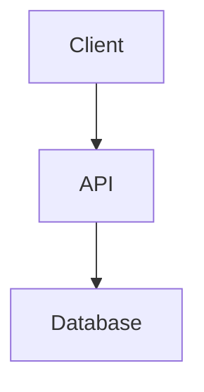

# LLM Optimization Guidelines — AI-Readable Documentation

Rules for producing documentation that AI/LLM systems (ChatGPT, Claude, Gemini, NotebookLM) can parse, understand, and reference accurately.

## Why This Matters

Modern users feed documentation into LLMs for:
- **Research**: NotebookLM digests docs into conversational Q&A
- **Code generation**: LLMs read docs to produce correct code
- **Support**: AI chatbots answer user questions from docs
- **Translation**: LLMs translate docs more accurately with clean structure

Poorly formatted docs produce **hallucinations**, **missed context**, and **wrong code**.

---

## 1. Clean Structure — Heading Hierarchy

LLMs use headings as section boundaries. Broken hierarchy = confused AI.

### Rules

| Rule | ✅ Correct | ❌ Wrong |
|------|-----------|---------|
| **Sequential levels** | H1→H2→H3 | H1→H3 (skipped H2) |
| **Single H1** | One `#` per file | Multiple `#` headings |
| **Self-documenting** | `## Authentication Flow` | `## Section 3` |
| **No formatting in headings** | `## Database Schema` | `## **Database** _Schema_` |

### Context Anchors

Start every section with a **one-sentence summary** of what it covers:

```markdown
## Authentication

The system uses JWT-based authentication with refresh token rotation.

### Login Flow
Users authenticate via email/password or OAuth2 providers...

### Token Management  
Access tokens expire after 15 minutes. Refresh tokens last 7 days...
```

**Why:** LLMs chunk by section. The opening sentence gives context even when sections are read in isolation.

---

## 2. Plain Text First — Avoid Encoding Issues

LLMs struggle with:
- Excessive HTML entities (`&amp;lt;`, `&amp;gt;`, `&amp;amp;`)
- Invisible Unicode characters (zero-width spaces, RTL marks)
- Non-standard quotation marks (`"` `"` instead of `"`)
- Emoji in headings or critical terms (decorative emoji in body is OK)

### Rules

| ✅ LLM-Friendly | ❌ Problematic |
|-----------------|---------------|
| `<` in code blocks | `&lt;` in body text |
| `"quoted text"` | `"smart quotes"` |
| `## Authentication` | `## 🔐 Authentication` |
| Plain ASCII arrows `->` | Unicode arrows `→` in code |

**Exception:** Emoji in decorative positions (bullet points, badges) is fine — just not in headings or key terms that LLMs need to match.

---

## 3. Consistent Terminology — Glossary

Use the **same term** for the same concept throughout all docs. LLMs build internal term graphs — inconsistency causes confusion.

### Create a Glossary Section

Add to `index.md` or a dedicated `glossary.md`:

```markdown
## Glossary

| Term | Definition | Also Known As |
|------|-----------|---------------|
| **User** | A registered account holder | Member, Account |
| **Token** | JWT access credential | Auth token, Bearer token |
| **Workspace** | Isolated project environment | Project, Tenant |
```

### Rules

- **Pick one term, use it everywhere.** Don't switch between "user", "member", and "account".
- **Define abbreviations on first use.** "Role-Based Access Control (RBAC)" then use "RBAC" after.
- **Cross-reference the glossary** when using domain-specific terms.

---

## 4. Table Formatting — LLM-Parseable

LLMs parse Markdown tables reliably **when formatted correctly**.

### Rules

| Rule | Detail |
|------|--------|
| **Use pipe syntax** | Standard `| col | col |` format |
| **No merged cells** | One value per cell |
| **Header row always** | First row = column names |
| **Separator row** | `|---|---|` after header |
| **No HTML tables** | Use Markdown tables only |
| **Align pipes** | Visually align for readability |
| **No blank rows** | Separators break table parsing |

```markdown
✅ CORRECT:
| Method | Endpoint      | Auth |
|--------|---------------|------|
| GET    | /api/users    | Yes  |
| POST   | /api/users    | Yes  |

❌ WRONG (HTML table, merged cells):
<table>
  <tr><td rowspan="2">Users</td><td>GET</td></tr>
  <tr><td>POST</td></tr>
</table>
```

---

## 5. Code Blocks — Always Specify Language

LLMs use the language tag to interpret code correctly.

### Rules

| Rule | ✅ Correct | ❌ Wrong |
|------|-----------|---------|
| **Language tag** | ` ```python ` | ` ``` ` (no tag) |
| **Runnable examples** | Complete, copy-pasteable | Fragments with `...` |
| **Consistent indentation** | 2 or 4 spaces | Mixed tabs/spaces |
| **No line numbers in code** | Raw code only | `1: import os` |
| **Output in separate block** | ` ```text\nOutput here\n``` ` | Mixed in same block |

```python
# ✅ Complete, runnable example with language tag
import requests

response = requests.get("https://api.example.com/users")
users = response.json()
print(f"Found {len(users)} users")
```

---

## 6. Diagram Text Fallback

Mermaid diagrams are **invisible to most LLMs** (they render as images). Always provide a text description.

### Pattern

```markdown
## Architecture Diagram



**Architecture summary:** The client sends requests to the API server,
which processes them and queries the PostgreSQL database. Responses flow
back through the same path. The API server handles authentication,
validation, and business logic.
```

**Why:** NotebookLM and ChatGPT cannot read Mermaid syntax. The text fallback ensures AI understands the diagram's meaning.

---

## 7. Flat File Structure — Easy Crawling

LLMs and NotebookLM import docs **file by file**. Deep nesting makes discovery harder.

### Recommended Structure

```
docs/
├── index.md              ← Entry point + glossary
├── architecture.md       ← System architecture
├── database.md           ← Database schema
├── deployment.md         ← Deployment guide
├── data-flow.md          ← Data flow diagrams
├── sop/
│   ├── index.md          ← SOP overview
│   └── [feature].md      ← One per feature (max 1 level deep)
├── api/
│   ├── index.md          ← API overview
│   └── [resource].md     ← One per resource
├── sitemap.md            ← Human-readable link index
└── sitemap-urls.txt      ← Plain URL list for NotebookLM
```

### Rules

- **Max 2 levels deep**: `docs/sop/feature.md` ✅ but `docs/sop/admin/settings/page.md` ❌
- **Index files**: every directory has `index.md` that lists all children
- **Self-contained pages**: each page can be understood without reading others
- **No circular dependencies**: page A references B, B doesn't need A to make sense

---

## 8. Chunk-Friendly Sections

LLMs have context windows. Write sections that work when extracted individually.

### Rules

| Rule | Target |
|------|--------|
| **Max words per section** | ≤500 words between H2 headings |
| **Section independence** | Each H2 section makes sense alone |
| **Repeat key context** | Re-state the subject in each section |
| **No "as mentioned above"** | Use explicit references: "As described in [Architecture](./architecture.md)" |

---

## 9. UTF-8 Clean Output

### Pre-publish Checks

- [ ] No invisible Unicode characters (BOM, zero-width spaces)
- [ ] No smart quotes (`"` `"` → use straight `"`)
- [ ] No em-dashes in code (`—` → use `--` or ` - `)
- [ ] No non-breaking spaces (use regular spaces)
- [ ] File saved as UTF-8 without BOM

### Validation Command

```bash
# Check for non-ASCII characters in docs
grep -rP '[^\x00-\x7F]' docs/ --include='*.md' | head -20
```

**Exception:** Non-ASCII is expected and valid in:
- Internationalized content (Vietnamese, Chinese, etc.)
- Emoji in decorative positions
- Names and proper nouns
