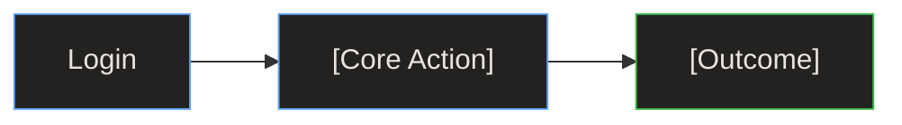
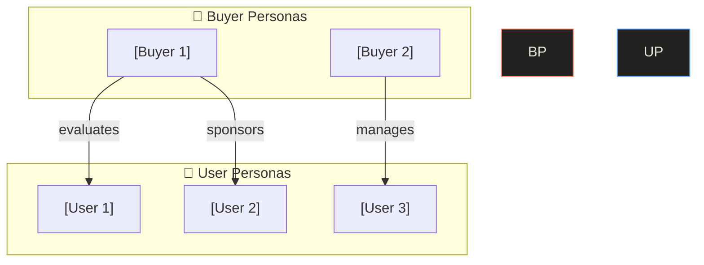

# Persona Builder — Knowledge Systematization Engine

Tự động phân tích source code để tạo **Buyer Personas** (người quyết định mua) và **User Personas** (người dùng thực tế). Lấy cảm hứng từ [GitLab Buyer Persona Framework](https://handbook.gitlab.com/handbook/marketing/brand-and-product-marketing/product-and-solution-marketing/roles-personas/buyer-persona/).

## Input Required

- `docs/analysis.md` (output from analyze-codebase)
- Access to source code (roles, permissions, pricing, README)

## Content Guidelines

**Before generating, read these skill files:**
- `skills/content-guidelines.md` — Structure, frontmatter, SEO fields
- `skills/content-writing.md` — SEO copywriting, keyword placement
- `skills/llm-optimization.md` — AI-readable structure

## Procedure

### 1. Extract Role Data from Codebase

Scan for role-related patterns:

| Signal | Where to Find | Example |
|--------|--------------|---------|
| **RBAC roles** | Auth middleware, guards, decorators | `@Roles('admin')`, `role === 'operator'` |
| **Permission matrices** | Config files, constants | `PERMISSIONS = { admin: [...] }` |
| **Route guards** | Middleware, HOC, route config | `requireAuth('manager')` |
| **Pricing tiers** | README, landing page, config | `plans: ['free', 'pro', 'enterprise']` |
| **User types** | DB models, enums, user schema | `enum UserType { BUYER, SELLER }` |
| **Onboarding flows** | Registration, signup pages | Multi-step forms with role selection |

### 2. Generate User Personas

For each role detected in the codebase, create a User Persona:

```markdown
---
title: "[Role Name] — User Persona"
description: "Profile of the [Role] user — goals, pain points, and feature usage"
keywords: ["persona", "[role]", "user profile"]
robots: "index, follow"
sidebar:
  order: [number]
---

# 👤 [Persona Name] — [Role Name]

> **Quick Reference**
> - **Role**: [Role from code — Admin / User / Operator / etc.]
> - **Tech Proficiency**: [🟢 Advanced | 🟡 Intermediate | 🔴 Basic]
> - **Frequency**: [Daily / Weekly / Monthly / On-demand]
> - **Key Modules**: [List of modules this role accesses]

## Profile

| Attribute | Detail |
|-----------|--------|
| **Persona Name** | [Vietnamese/contextual name, e.g. "Quản Trị Viên Minh"] |
| **Role in System** | [Exact role value from code] |
| **Reports To** | [Inferred from hierarchy] |
| **Team Size** | [Estimate from context] |

## Goals & Motivations

- 🎯 [Goal 1 — derived from feature usage patterns]
- 🎯 [Goal 2]
- 🎯 [Goal 3]

## Pain Points & Frustrations

- 😤 [Pain point 1 — derived from error handling, validators]
- 😤 [Pain point 2]
- 😤 [Pain point 3]

## Feature Usage Map

| Feature/Module | Access Level | Frequency | JTBD |
|---------------|-------------|-----------|------|
| [Feature 1] | Full | Daily | [Job statement] |
| [Feature 2] | Read-only | Weekly | [Job statement] |

## Typical Workflow



## Permissions Matrix

| Resource | Create | Read | Update | Delete |
|----------|--------|------|--------|--------|
| [Resource 1] | ✅ | ✅ | ✅ | ❌ |
| [Resource 2] | ❌ | ✅ | ❌ | ❌ |
```

### 3. Generate Buyer Personas

For each business stakeholder / decision-maker level, create a Buyer Persona (GitLab format):

```markdown
---
title: "[Buyer Persona Name] — Buyer Persona"
description: "Buyer profile for [persona] — JTBD, challenges, decision criteria"
keywords: ["buyer persona", "[role]", "decision maker"]
robots: "index, follow"
sidebar:
  order: [number]
---

# 🏢 [Persona Name] — Buyer Persona

> **Quick Reference**
> - **JTBD**: [Main job statement — Verb + Object + Clarifier]
> - **Buyer Type**: [Decision Maker / Champion / Influencer / End User]
> - **Purchase Involvement**: [Initiator / Evaluator / Approver]

## Summary

> [2-3 sentence narrative summary of this persona's worldview, priorities, and buying behavior]

## Job To Be Done

**[Verb + Object + Clarifier]**

_Example: "Streamline team collaboration to ship products faster with fewer errors"_

## Profile

| Attribute | Detail |
|-----------|--------|
| **Potential Titles** | [CTO / VP Engineering / Director IT / etc.] |
| **Reports To** | [CEO / Board / VP] |
| **Team Managed** | [Dev team / IT dept / Operations] |
| **Budget Authority** | [Direct / Influencer / None] |

## Motivations

- 💡 [Motivation 1 — what drives their interest]
- 💡 [Motivation 2]
- 💡 [Motivation 3]

## Biggest Challenges

- 🔥 [Challenge 1 — obstacles they face daily]
- 🔥 [Challenge 2]
- 🔥 [Challenge 3]

## Decision Criteria

| Priority | Criteria | Weight |
|----------|---------|--------|
| 1 | [e.g. ROI / Time-to-value] | 🔴 Critical |
| 2 | [e.g. Security compliance] | 🟡 Important |
| 3 | [e.g. Vendor support] | 🟢 Nice-to-have |

## Key Messaging

> Messages that resonate with this persona:

- ✅ [Message 1 — aligned with their JTBD]
- ✅ [Message 2]
- ✅ [Message 3]

## Information Sources

| Channel | Priority |
|---------|----------|
| [Events & Meetups / Case Studies / Webinars] | Primary |
| [Blog posts / Newsletters / Whitepapers] | Secondary |
| [Podcasts / Social media] | Tertiary |
```

### 4. Generate Persona ↔ Feature Matrix

Create a cross-reference matrix:

```markdown
---
title: "Persona × Feature Matrix"
description: "Which personas use which features — comprehensive access map"
keywords: ["persona", "feature matrix", "access"]
sidebar:
  order: 99
---

# Persona × Feature Matrix

## User Persona → Feature Map

| Feature | [Persona 1] | [Persona 2] | [Persona 3] |
|---------|-------------|-------------|-------------|
| [Feature A] | ✅ Full | 👁️ Read | ❌ No |
| [Feature B] | ✅ Full | ✅ Full | 👁️ Read |

## Buyer Persona → Value Map

| Value Proposition | [Buyer 1] | [Buyer 2] |
|------------------|-----------|-----------|
| [Value 1] | 🔴 Critical | 🟡 Important |
| [Value 2] | 🟡 Important | 🔴 Critical |
```

### 5. Generate Index File

Output `docs/personas/index.md`:

```markdown
---
title: "Personas — Overview"
description: "Buyer and User Personas extracted from codebase analysis"
keywords: ["personas", "buyer persona", "user persona"]
robots: "index, follow"
sidebar:
  order: 1
---

# Personas

> **Quick Reference**
> - **User Personas**: [count] (from roles in codebase)
> - **Buyer Personas**: [count] (from stakeholder analysis)
> - **Last Updated**: [date]
> - **Source**: Automated extraction from codebase

## Persona Ecosystem



## Directory

### Buyer Personas
| # | Persona | JTBD | Buyer Type |
|---|---------|------|-----------|
| 1 | [Name](./buyer-name.md) | [Job statement] | Decision Maker |

### User Personas  
| # | Persona | Role | Key Modules | Frequency |
|---|---------|------|------------|-----------|
| 1 | [Name](./user-name.md) | Admin | [modules] | Daily |
```

## Output Structure

```
docs/personas/
├── index.md              # Overview + directory
├── buyer-[name].md       # One per buyer persona
├── user-[name].md        # One per user persona
└── feature-matrix.md     # Cross-reference matrix
```

## Rules

- **Derive from code** — NEVER invent personas without evidence from the codebase
- **Use GitLab format** for Buyer Personas: JTBD, Summary, Messaging, Titles, Challenges
- **Name personas** with contextual names (e.g., "Admin An", "Seller Sang") — memorable
- **Cite source**: `(file_path:line_number)` for every claim
- **Link to JTBD**: Every persona must have at least 1 JTBD statement
- **Link to SOP**: Persona → which SOPs are relevant to them
- **Mermaid dark-mode colors**: fill `#232221`, stroke `#60A5FA`, text `#E8E5DF`
- **SEO frontmatter** — include `title`, `description`, `keywords`, `robots`
- **Progressive disclosure** — Use `<details>` for detailed permission matrices
- **Min 2 internal links** per persona page (to SOPs, JTBD, or other personas)
