# SOP User Guide Generator — Knowledge Systematization Edition

Generate professional Standard Operating Procedure (SOP) user guides enriched with **Persona context**, **JTBD alignment**, and **Process Flow diagrams**. Mỗi SOP giờ không chỉ là hướng dẫn step-by-step, mà là tài liệu tri thức hoàn chỉnh.

## Input Required

- `docs/analysis.md` (output from analyze-codebase)
- `docs/personas/` (output from persona-builder — **RECOMMENDED**)
- `docs/jtbd/` (output from jtbd-analyzer — **RECOMMENDED**)
- `docs/flows/` (output from flow-mapper — **RECOMMENDED**)
- Access to source code (routes, UI components, views)

## Content Guidelines

**Before generating, read these skill files:**
- `skills/content-guidelines.md` — Structure, frontmatter, SEO fields
- `skills/content-writing.md` — SEO copywriting, keyword placement, FAQ schema
- `skills/llm-optimization.md` — AI-readable structure
- `skills/seo-checklist.md` — Post-generation SEO audit

## Procedure

### 0. Knowledge Foundation (NEW — RUN FIRST)

> [!IMPORTANT]
> Nếu `docs/personas/`, `docs/jtbd/`, `docs/flows/` chưa tồn tại, **chạy 3 skill sau TRƯỚC**:
> 1. `skills/persona-builder.md` → tạo `docs/personas/`
> 2. `skills/jtbd-analyzer.md` → tạo `docs/jtbd/`
> 3. `skills/flow-mapper.md` → tạo `docs/flows/`
>
> Nếu đã tồn tại, đọc chúng để enrich SOP content.

### 1. Identify User-Facing Features

Scan the codebase for:
- Frontend routes/pages (Next.js pages, React routes, view templates)
- UI components that represent features
- API endpoints that correspond to user actions
- Role-based access (admin, user, operator)

### 2. Group by Module (Miller's Law: 5-9 items per group)

Organize features into logical modules:
```
Module: User Management (4 features)
├── Login / Register
├── Account Settings
├── Role Assignment
└── Password Reset
```

### 3. Generate SOP per Feature

Output to `docs/sop/[module-name].md`

## SOP Template (Knowledge-Enriched)

Each SOP file MUST follow this structure:

```markdown
---
title: "[Feature Name] — User Guide"
description: "Step-by-step guide to [feature]. Covers prerequisites, walkthrough, troubleshooting, and FAQ."
keywords: ["[feature]", "user guide", "how to"]
robots: "index, follow"
sidebar:
  order: [number]
---

# [Feature Name]

> **Quick Reference**
> - **Who**: [Role required — Admin / User / Operator]
> - **Where**: [Menu > Submenu > Page]
> - **Time**: ~[estimated minutes] to complete
> - **Prerequisites**: [Brief list]

## Persona Context

> **This guide is for**: [Persona Name](../personas/user-name.md)
>
> **Job To Be Done**: [JTBD statement](../jtbd/job-name.md)
> — _"When [situation], I want to [action], so that [outcome]"_

| Attribute | Detail |
|-----------|--------|
| **Role** | [Role from code] |
| **Frequency** | [How often this task is performed] |
| **Complexity** | [🟢 Easy | 🟡 Medium | 🔴 Hard] |
| **Related Jobs** | [Small Job 1], [Small Job 2] |

## Process Flow

```mermaid
graph TB
    style S fill:#2d333b,stroke:#3fb950,color:#e6edf3
    style E fill:#2d333b,stroke:#3fb950,color:#e6edf3

    S(["▶ Start"])
    A["Step 1: [Action]"]
    B["Step 2: [Action]"]
    C{"Decision?"}
    D["Step 3a"]
    F["Step 3b"]
    E(["✅ Done"])

    S --> A --> B --> C
    C -->|"Yes"| D --> E
    C -->|"No"| F --> E
```



> 📊 **Full diagrams**: [Workflow](../flows/wf-name.md) · [Sequence](../flows/seq-name.md) · [Lifecycle](../flows/lc-name.md)

## Prerequisites

- [ ] Logged in with role **[role]**
- [ ] Have [prerequisites]

## Step-by-Step Guide

### Step 1: [Step Name]

1. Navigate to **[Menu] → [Submenu]**
2. Click the **[Button Name]** button
3. Fill in the information:

   | Field | Required | Description | Example |
   |-------|----------|-------------|---------|
   | Name | ✅ | Full Name | Jane Doe |

4. Click **Save** to complete

<!-- Screenshot: [Description of screenshot to take] -->

:::tip
[Helpful tip for this step — derived from common user behavior]
:::

### Step 2: [Step Name]
[Continue...]

## Expected Results

- ✅ [Result 1]
- ✅ [Result 2]

## User Journey


## Troubleshooting

<details>
<summary>🔴 Error: [Error Message 1]</summary>

**Cause:** [Root cause]

**Solution:**
1. [Step to fix]
2. [Step to fix]

**Source:** `(file_path:line_number)`

</details>

<details>
<summary>🔴 Error: [Error Message 2]</summary>

**Cause:** [Root cause]

**Solution:**
1. [Step to fix]

</details>

## FAQ

<details>
<summary>Q: [Question 1]?</summary>

**A:** [Answer derived from actual code logic]

</details>

<details>
<summary>Q: [Question 2]?</summary>

**A:** [Answer]

</details>

## Related

- **Persona**: [Persona Name](../personas/user-name.md)
- **JTBD**: [Job Statement](../jtbd/job-name.md)
- **Workflow**: [Flow Name](../flows/wf-name.md)
- [Related SOP](./related-module.md)
- API: `[METHOD] /api/endpoint`
```

## Index File (Knowledge-Enriched)

Generate `docs/sop/index.md`:

```markdown
---
title: "User Guides — Overview"
description: "Complete index of user guides and standard operating procedures"
keywords: ["user guide", "SOP", "how to"]
robots: "index, follow"
sidebar:
  order: 1
---

# User Guides

> **Quick Reference**
> - **Total Features**: [count]
> - **Roles**: Admin, User, Operator
> - **Last Updated**: [date]

## Persona Navigation

> Choose your role to see relevant guides:

| Persona | Role | Key Guides | JTBD |
|---------|------|-----------|------|
| [👤 Persona 1](../personas/user-name.md) | Admin | [Guide A](./guide-a.md), [Guide B](./guide-b.md) | [Job statement] |
| [👤 Persona 2](../personas/user-name.md) | User | [Guide C](./guide-c.md) | [Job statement] |

## System Workflow Overview


## Feature List

| No. | Feature | Description | Role | Difficulty | JTBD |
|-----|---------|-------------|------|------------|------|
| 1 | [Name] | [Description] | [Role] | 🟢 Easy | [Job] |
```

## Rules

- **Knowledge Foundation first** — Run persona-builder, jtbd-analyzer, flow-mapper BEFORE SOPs
- **Quick Reference card** at top of every SOP
- **Persona Context section** — link to persona + JTBD statement (NEW)
- **Process Flow diagram** — inline Mermaid workflow per SOP (NEW)
- **User Journey** — inline Mermaid journey map per SOP (NEW)
- **Number every step** — users must be able to follow exactly
- **Include form field tables** with real examples
- **Use `<details>` for Troubleshooting & FAQ** (Progressive Disclosure — Hick's Law)
- **Use `:::tip`** for helpful hints within steps
- **Add `<!-- Screenshot: ... -->` placeholders** where visual guidance helps
- **Link to related SOPs** and API docs (≥2 internal links per page)
- **Link to Personas, JTBD, Flows** (≥3 cross-reference links per SOP) (NEW)
- **Keep language simple and direct** — assume non-technical users
- **Derive FAQ from actual validation rules** and business logic in code
- **FAQ in schema-ready format**: `### Question?` under `## FAQ` (for rich snippets)
- **Cite source**: `(file_path:line_number)` for technical accuracy
- **SEO frontmatter** — include `title`, `description`, `keywords`, `robots` in every file
- **Estimate time** for each guide in the Quick Reference
- **Run SEO checklist** (`skills/seo-checklist.md`) after generation
