# Technical Documentation Generator — UX Master Edition

Generate professional technical system documentation with rich diagrams, visual hierarchy, and progressive disclosure.

## Input Required

- `docs/analysis.md` (output from analyze-codebase)
- Access to source code for deep tracing

## Content Guidelines

**Before generating, read these skill files:**
- `skills/content-guidelines.md` — Structure, frontmatter, SEO fields
- `skills/content-writing.md` — SEO copywriting, keyword placement
- `skills/llm-optimization.md` — AI-readable structure
- `skills/seo-checklist.md` — Post-generation SEO audit

## Output Files

### 1. `docs/architecture.md` — System Architecture

```markdown
---
title: "System Architecture"
description: "Architecture overview, system design, and key technical decisions"
keywords: ["architecture", "system design", "tech stack"]
robots: "index, follow"
sidebar:
  order: 2
---

# System Architecture

> **Quick Reference**
> - **Type**: [Monolith / Microservices / Serverless]
> - **Stack**: [Primary technologies]
> - **Key Modules**: [Core module names]
> - **Deployment**: [Docker / K8s / Serverless]

## Overview
[Brief description of what the system does and who it serves]

## Architecture Diagram

```mermaid
graph TB

    Client["🌐 Client"] --> API["⚙️ API Server"]
    API --> DB["🗄️ Database"]
```



## Core Components

| Component | Description | Technology | Key Files |
|-----------|-------------|------------|-----------|

## Main Processing Flow


## Architecture Decision Records (ADR)

| # | Decision | Context | Status |
|---|----------|---------|--------|
| 1 | [Decision] | [Why this was chosen] | Accepted |
| 2 | [Decision] | [Why this was chosen] | Accepted |

<details>
<summary>ADR-001: [Decision Title]</summary>

**Context:** [What problem were we solving?]

**Decision:** [What we decided]

**Consequences:**
- ✅ [Positive outcome]
- ⚠️ [Trade-off]
- ❌ [Risk accepted]

</details>

## Security
[Auth model, trust boundaries, data sensitivity]

## Scalability & Performance

| Aspect | Strategy | Limit |
|--------|----------|-------|
| Caching | [Strategy] | [Max size/TTL] |
| Rate Limiting | [Strategy] | [Requests/min] |
| Scaling | [Horizontal/Vertical] | [Max instances] |
```

### 2. `docs/database.md` — Database

```markdown
---
title: "Database Schema & Data Model"
description: "Database schema, entity relationships, indexes, and migration history"
keywords: ["database", "schema", "data model"]
robots: "index, follow"
sidebar:
  order: 3
---

# Database

> **Quick Reference**
> - **Engine**: [PostgreSQL / MySQL / MongoDB / SQLite]
> - **ORM**: [Prisma / SQLAlchemy / TypeORM / None]
> - **Tables**: [Count]
> - **Migrations**: [Tool used]

## ER Diagram


## Tables

### [Table Name]
| Column | Type | Nullable | Default | Description |
|--------|------|----------|---------|-------------|

## Relationships
| Table A | Table B | Type | FK | ON DELETE |
|---------|---------|------|----|-----------|

## Indexes & Constraints

| Table | Index | Columns | Type | Purpose |
|-------|-------|---------|------|---------|

<details>
<summary>Migration History</summary>

| Version | Date | Description |
|---------|------|-------------|
| 001 | [date] | Initial schema |

</details>
```

### 3. `docs/deployment.md` — Deployment

```markdown
---
title: "Deployment & Infrastructure Guide"
description: "Installation, configuration, deployment, and monitoring setup"
keywords: ["deployment", "installation", "infrastructure"]
robots: "index, follow"
sidebar:
  order: 4
---

# Deployment Guide

> **Quick Reference**
> - **Platform**: [Docker / AWS / Vercel / Bare Metal]
> - **Min Requirements**: [CPU / RAM / Disk]
> - **Ports**: [List of ports used]
> - **Health Check**: `GET /health`

## System Requirements

| Component | Minimum | Recommended |
|-----------|---------|-------------|
| CPU | [min] | [recommended] |
| RAM | [min] | [recommended] |
| Disk | [min] | [recommended] |
| Runtime | [version] | [version] |

## Environment Variables

| Variable | Description | Required | Default | Example |
|----------|-------------|----------|---------|---------|

:::warning Security
Never commit `.env` files. Use secrets management in production.
:::

## Local Setup

```bash
# Step 1: Clone
git clone [repo_url]
cd [project]

# Step 2: Install dependencies
[install_command]

# Step 3: Configure
cp .env.example .env
# Edit .env with your values

# Step 4: Run
[run_command]
```

## Docker Deployment

```yaml
# docker-compose.yml explanation
```

## CI/CD Pipeline

```mermaid
graph LR
    A["🔀 Push"] --> B["🧪 Test"]
    B --> C["📦 Build"]
    C --> D["🚀 Deploy"]
```



## Monitoring & Health

| Endpoint | Purpose | Expected |
|----------|---------|----------|
| `GET /health` | Health check | `200 OK` |
| `GET /metrics` | Prometheus | Metrics data |
```

### 4. `docs/data-flow.md` — Data Flow

```markdown
---
title: "Data Flow & Integration Points"
description: "Data flow diagrams, processing pipelines, and external integrations"
keywords: ["data flow", "integration", "workflow"]
robots: "index, follow"
sidebar:
  order: 5
---

# Data Flow

> **Quick Reference**
> - **Pattern**: [Request-Response / Event-Driven / Streaming]
> - **Protocol**: [REST / gRPC / WebSocket / GraphQL]
> - **Serialization**: [JSON / Protobuf / MessagePack]

## End-to-End Data Flow

```mermaid
graph TB

    Input["📥 Input"] --> Process["⚙️ Processing"]
    Process --> Output["📤 Output"]
```



## Main Workflows

### [Feature Name]


1. User action → ...
2. API receives → ...
3. Business logic → ...
4. Database → ...
5. Response → ...

## External Integrations

| Service | Protocol | Direction | Data | Rate Limit |
|---------|----------|-----------|------|------------|

## Events / Webhooks

| Event | Trigger | Payload | Consumer |
|-------|---------|---------|----------|
```

## Rules

- **Quick Reference card** at top of every file (summary box)
- **Minimum 2 Mermaid diagrams per file**
- **Text description** alongside every Mermaid diagram (for LLM parsing)
- **Every claim cites** `(file_path:line_number)`
- **No inline `style` in Mermaid** — let native themes handle colors (auto light/dark)
- **Use admonitions** (`:::tip`, `:::warning`, `:::danger`) for callouts
- **Use `<details>` Progressive Disclosure** for secondary information
- **Tables** for all structured data — never use bullet lists for tabular data
- **Explain WHY before WHAT** in every section
- **≥2 internal links** per page to other docs
- **SEO frontmatter** — include `title`, `description`, `keywords`, `robots` in every file
- **Self-contained sections** — each H2 makes sense when read alone (LLM chunking)
- **Run SEO checklist** (`skills/seo-checklist.md`) after generation
